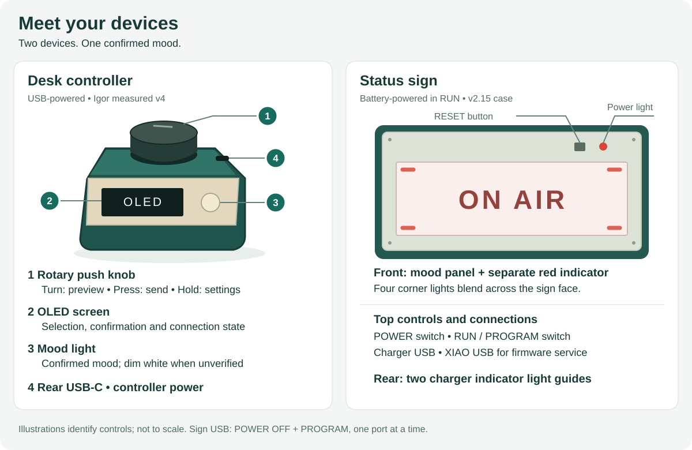
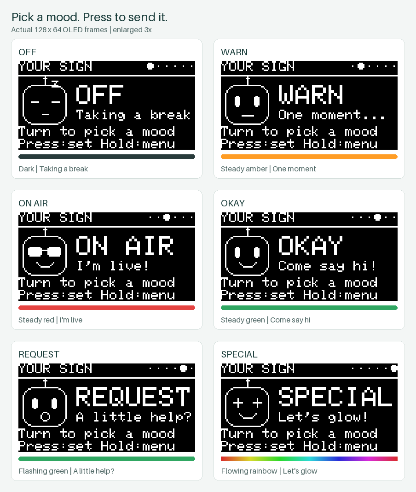
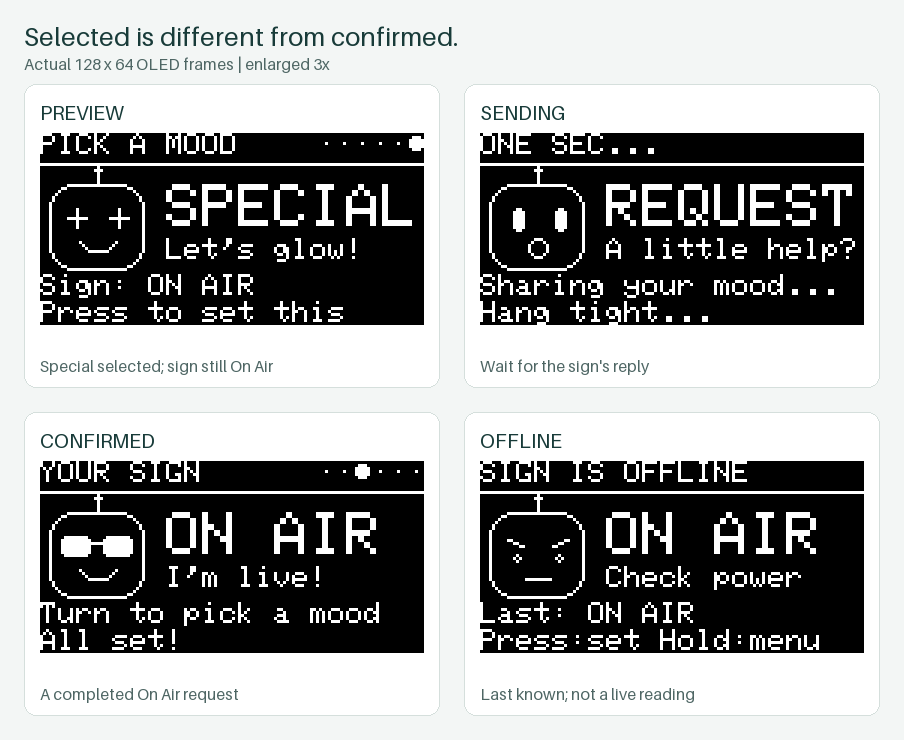
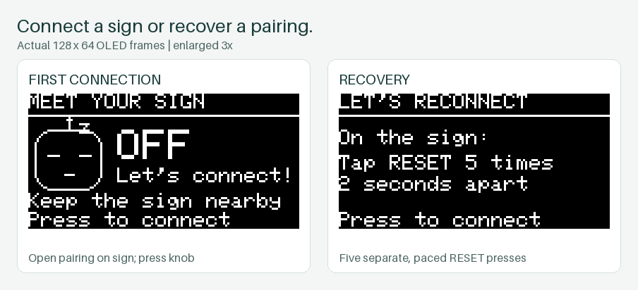
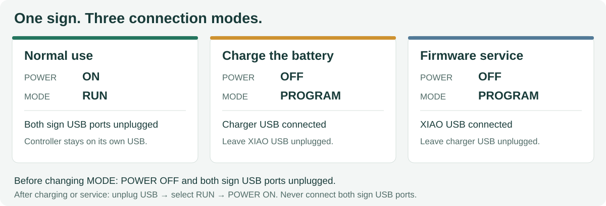

# Little On Air

A wireless status sign for your desk, door or studio. Choose a mood on the desk
controller, press the knob, and the sign shows people whether you're available,
on air, waiting or asking for a little help.

The controller and sign communicate directly over Bluetooth. No phone app,
Wi-Fi network or account is needed. You choose the status yourself; Little On
Air does not automatically detect recording, calls or streaming software.

**This is the product manual.** For assembly, parts, source code, builds and
feature development, see the [developer guide](CONTRIBUTING.md).

## In this guide

- [Meet your devices](#meet-your-devices)
- [Quick start](#quick-start)
- [Choose a mood](#choose-a-mood)
- [Read the controller screen](#read-the-controller-screen)
- [Controls and settings](#controls-and-settings)
- [Connect or change a sign](#connect-or-change-a-sign)
- [Power and charging](#power-and-charging)
- [Understand the indicator lights](#understand-the-indicator-lights)
- [Troubleshooting](#troubleshooting)
- [Versions and further help](#versions-and-further-help)

## Meet your devices

The **desk controller** has a rotary knob that also presses like a button, a
small OLED screen and a round mood light beside the screen. Its rear USB-C port
provides power from your computer or a USB supply. It has no battery.

The **sign** has a lit front panel, a small rectangular **RESET** button and a
separate round red power indicator. The top has the **POWER** switch, a smaller
**RUN / PROGRAM** mode switch, a charger USB port and a separate XIAO USB port
for servicing. Two light guides at the rear expose the charger indicators.

The drawings are control maps, not assembly or dimensioned drawings. Locate the
two different sign USB ports before connecting a cable; they have different jobs.

## Quick start

For an assembled, commissioned pair:

1. With the sign's **POWER OFF** and both of its USB ports unplugged, select
   **RUN**. Turn **POWER ON**. Leave both sign USB ports unplugged during use.
2. Plug the controller into USB power. Keep the devices nearby for setup.
3. If already paired, the controller checks the sign and displays its mood.
   If it says **MEET YOUR SIGN**, tap the sign's **RESET** once, then press the
   controller knob to connect during the 60-second pairing window.
4. Turn the knob to choose a mood. **Press once to send it.** Wait for
   **YOUR SIGN** and the selected mood to appear as confirmed.

Turning alone is a preview: it does not change either device's mood light.
The sign remembers its last accepted mood through a normal power cycle.

## Choose a mood

These screenshots use the controller's actual display code and font, enlarged
without smoothing. The color strips are a guide to the lights, not part of the
monochrome OLED. Colors on a monitor are approximate.

| Mood | Sign and controller mood light | Suggested meaning |
| --- | --- | --- |
| **Off** | Dark | Taking a break; no illuminated status |
| **Warn** | Steady warm amber | One moment; please wait |
| **On Air** | Steady red | I'm live; please avoid interruptions |
| **Okay** | Steady green | Come say hi; available |
| **Request** | Green flashing on for 0.6 seconds, off for 0.6 seconds | A little help, please |
| **Special** | A slow, flowing rainbow, repeating about every 20 seconds | Let's glow; a decorative or special status |

Agree on the meanings with the people around you. The colors are signals you
choose, not measurements of your activity.

Turning forward cycles **Off → Warn → On Air → Okay → Request → Special → Off**.
Turn the other way to go backward. Pressing a mood that is already confirmed
shows **Already set!** and leaves the sign alone.

The sign's four corner lights blend across its face. In Special, different
corners show different parts of the rainbow. The controller has one mood light;
its animation and the sign's animation do not have to move in exact step.

**Off turns off the mood lights, not the sign's power.** Its separate red power
indicator remains on while the sign is powered and paired.

## Read the controller screen

The large word is the mood currently selected on the knob. Read the heading
and the smaller line to tell whether that mood has reached the sign. The six
dots at the top show the selected mood's position in the cycle; they are not
a battery gauge or signal-strength meter.

| Screen or message | What it means | What to do |
| --- | --- | --- |
| **YOUR SIGN** | The displayed mood has been checked with the sign | Turn to choose another mood, or leave it as it is |
| **PICK A MOOD** with **Sign: ON AIR**, for example | You are previewing a different mood; the smaller line is the confirmed sign state | Press to apply the large selection |
| **ONE SEC…**, **Sharing your mood…**, **Waiting for the sign** | A foreground operation is in progress | Wait for confirmation or an error |
| **All set!** | The sign confirmed the requested mood | No further action needed |
| **SIGN IS OFFLINE** with **Last: …** | The stored value has not been verified in the current connection state | Check sign power and distance; use **Check my sign** |
| **Last: not checked** | There is no confirmed saved value to show | Connect and check the sign |
| **MEET YOUR SIGN** | The controller has no paired sign | Open the sign's pairing window and press the knob |

A **Last:** value is a memory, not a live reading. When the controller cannot
verify the sign, its own mood light is dim white. It returns to the mood color
after a successful check. White is not a seventh mood.

The controller checks the sign on startup and periodically while on the home
screen. These background checks do not change the mood, restart the animations
or wake the OLED. After a connection failure it makes a few read-only retries.
If a send fails, it does not keep replaying that command later; check the screen
and press again when the sign is available.

## Controls and settings

### The knob

| Action | On the home screen | In settings |
| --- | --- | --- |
| **Turn** | Preview the next or previous mood | Move through choices |
| **Press and release** | Send the selected mood; connect if unpaired | Choose the highlighted item |
| **Hold for 1.2 seconds** | Open settings | Return to the home screen |

Holding and releasing does not also count as a click. The controller also
ignores a knob held down while it starts, so plugging it in with the knob
pressed does not send a mood or erase pairing.

### Settings menu

Hold the knob, turn to an item and press to select it.

| Item | What it does |
| --- | --- |
| **Back to my sign** | Return to the home screen |
| **Check my sign** | Read the sign's current mood without changing it |
| **Connect a sign** | Pair an unpaired controller with a sign in its pairing window; an already paired controller says **Already connected!** |
| **Light test** | Test the controller's small mood light; see below |
| **Forget this sign** | Ask for confirmation, then remove the pairing; see [changing or reconnecting a sign](#changing-or-reconnecting-a-sign) |

Settings and an unanswered Forget confirmation return home after 30 seconds
without input. You can also hold the knob to leave them.

### Light test

**Light test** affects only the controller's round light. It does not change the
sign or its saved mood. The screen says **LIGHT CHECK** and shows the test color
and counts of turns and clicks.

The test starts red. Turn or click to cycle through **Off, Red, Green, Blue,
White and Yellow**. Hold to finish, or let it exit after 60 seconds without
input. The controller then resumes its usual confirmed-mood or offline light.

### Screen sleep

The OLED dims after 30 seconds without activity and turns off after two minutes.
The first turn, click or hold while it is asleep **only wakes it**. Make the
gesture again to select, send or open settings. The mood light continues to work
while the screen sleeps.

If your computer removes USB power during sleep, the controller turns off.
The battery-powered sign keeps its saved mood. When USB power returns, the
controller reads the sign; startup does not advance or send a new mood.

## Connect or change a sign

### First connection

1. Power the sign in **RUN** on its battery, with both sign USB ports unplugged.
2. Tap the unpaired sign's **RESET** once. Its red indicator blinks quickly for
   the **60-second pairing window**.
3. Press the unpaired controller's knob, or choose **Connect a sign**. Keep the
   devices nearby and allow the search to finish; it can take several seconds.
4. Look for **YOUR SIGN** and a confirmed mood. The sign's red power light becomes
   steady after it is paired.

There is no PIN to type. Each controller/sign pairing is for one partner.
If the pairing window expires, tap RESET once to open it again on an unpaired
sign. Ordinary power cycles keep an existing pairing.

### Changing or reconnecting a sign

Keep the old sign powered and nearby. Hold the controller knob and choose
**Forget this sign**. The confirmation starts on **Keep my sign**; turn to
**Forget sign** and press to proceed. Hold to cancel instead.

With matching current firmware and a reachable sign, this unlinks both devices.
The sign restarts, clears its saved mood to Off and opens its pairing window.
When the controller says **Ready to connect!**, press to pair again, or open the
pairing window on the replacement sign you want to use. Only put the intended
sign into pairing mode nearby.

If the old sign cannot be reached, the controller still forgets its own pairing
and displays the recovery instructions below. The old sign retains its keys
until you reset its pairing locally.

### Five-reset recovery

Use this if a sign still remembers an old controller, online Forget could not
reach it, or the devices have mismatched pairing records.

1. If the controller still has an old pairing, use **Forget this sign** first.
2. With the sign powered in RUN, press and release its **RESET five times**, about
   **two seconds apart**. Let the application start between presses.
3. After the fifth reset, the sign forgets its pairing and saved mood, returns
   to Off and opens a 60-second pairing window.
4. Press the unpaired controller's knob to connect.

This is five separate presses, not a long hold. A gap of six seconds of normal
running clears an incomplete count; if you lose count, wait and start again.
A power cycle also clears an incomplete count. Avoid a rapid double tap: that
enters the firmware bootloader instead. If you accidentally do that, a normal
power cycle returns to the application when valid firmware is installed.

## Power and charging

**Before connecting either USB port on the sign: set POWER OFF and select
PROGRAM. Connect only one sign USB port at a time.** The sign does not have an
automatic USB/battery power selector. Do not charge it while using it in RUN.

| Activity | POWER | MODE | Sign USB connection |
| --- | --- | --- | --- |
| Normal use | **ON** | **RUN** | Neither port |
| Turn the sign off | **OFF** | RUN | Neither port |
| Charge the battery | **OFF** | **PROGRAM** | **Charger USB only** |
| Firmware service | **OFF** | **PROGRAM** | **XIAO USB only**; see the developer guide |

To charge:

1. Turn POWER OFF. With both USB cables removed, move MODE to PROGRAM.
2. Connect power to the **charger USB port**. Leave XIAO USB unplugged.
3. The rear light guides show the charger's indicators. Their meaning depends
   on the fitted charger board; use its verified labels. The OLED does not show
   battery percentage or a charging estimate.
4. After charging, unplug USB first. With POWER still OFF, select RUN, then turn
   POWER ON to use the sign.

Only change MODE with POWER OFF and both USB ports unplugged. PROGRAM provides
electrical isolation; selecting it does not itself start a firmware update.
POWER OFF disconnects the normal load but does not disconnect the battery from
the charging board.

The controller's USB port is separate from these restrictions: it normally stays
plugged in during use. Do not open a powered sign or charge a damaged battery;
have wiring, a loose connector or battery replacement checked using the
[assembly and commissioning guidance](CONTRIBUTING.md#hardware-and-bill-of-materials).

## Understand the indicator lights

There are three different kinds of light:

| Light | Appearance | Meaning |
| --- | --- | --- |
| Sign's large front panel | One of the six moods | The sign's saved, active mood |
| Controller's round light | Mood color or animation | The mood confirmed by the sign, not the knob preview |
| Controller's round light | Dim steady white | The sign's state is currently unverified |
| Sign's small front power indicator | Steady red | Powered and paired; stays red even when the mood is Off |
| Sign's small front power indicator | Fast red blink, about twice per second | Unpaired; pairing window is open |
| Sign's small front power indicator | Mostly red with a short dark gap every two seconds | Unpaired; pairing window has closed |
| Rear charger light guides | Charger-board indicators | Charging status, separate from Bluetooth and mood |

The little face on the OLED is decorative and sometimes blinks. Use the screen
heading and text to judge connection state.

## Troubleshooting

| Symptom | Try this |
| --- | --- |
| Turning the knob does not change the sign | Press to send the preview. If the screen was asleep, the first gesture only woke it. |
| Screen is dark | Press once to wake it. If it stays dark, check controller USB power and the cable. |
| **SIGN IS OFFLINE** or **Can't reach your sign** | Check sign battery/power and RUN mode, move closer, then use **Check my sign**. A Last value is not confirmation. |
| Controller light is white | It is waiting for a verified sign state. Check power and use **Check my sign**. |
| Controller is on but sign is dark | Off is a valid mood. Check the sign's separate red indicator, then send Okay or On Air. If the indicator is also off, check power and charge the battery using the sequence above. |
| The sign stays red after choosing Off | The small power indicator should stay red. The large front mood panel should be dark. |
| Pairing does not finish | Open the sign's 60-second window again and keep it nearby. If either device remembers a different partner, use Forget and the five-reset recovery steps. |
| **Already connected!** when choosing Connect | Connect does not replace a partner. Use **Forget this sign** before changing signs. |
| **One sec, please!** | Let the current operation finish before starting another. |
| **Press to try again** after a failed operation | Restore connectivity, then press again. A failed request is not silently sent later. |
| Mood animation resumes when the controller is unplugged | Expected: the sign runs independently and retains its mood. |
| Reset seems to enter an update mode | Avoid rapid double taps. Power-cycle normally, then space pairing-reset presses about two seconds apart. |
| **State save failed**, **Cache clear failed**, or repeated **Radio needs a restart** | Restart the controller and check again. If it recurs, record the exact message and firmware versions for service; do not repeatedly erase pairing as a substitute for diagnosis. |
| Front panel flickers, shows the wrong color or only some corners light | Check with another steady mood. If it persists, stop and have the pixel wiring and matching receiver firmware checked; Light test only tests the controller light. |

## Versions and further help

This manual describes the **ESP32-S3 controller firmware 0.4.0** with the current
matching four-pixel nRF52840 receiver firmware, **Igor measured v4 controller**
and **v2.15 sign case** with open-backed frame wire channels. This project
maintains this one device pair; install the current controller and receiver
firmware together when updating.

Manufacturing ZIPs preserve the firmware that shipped with their design snapshot;
that may be older than this manual. Use the [developer firmware guide](CONTRIBUTING.md#build-and-flash)
when updating a device, and follow the sign's USB isolation sequence above.

- [Developer guide](CONTRIBUTING.md): BOM, wiring, architecture, setup, builds,
  tests, diagnostics and making changes.
- [Current hardware](hardware/README.md): assembly guides and print files.
- [Recorded hardware observations](docs/PAIRING_POWER_UPDATE.md): what has
  actually been checked on the assembled devices.
- [Report a problem](https://github.com/sayhiben/little-on-air/issues): include
  the screen message, selected mood, power arrangement and installed versions.

## License

[MIT](LICENSE). Hardware source attribution is recorded with each design.
