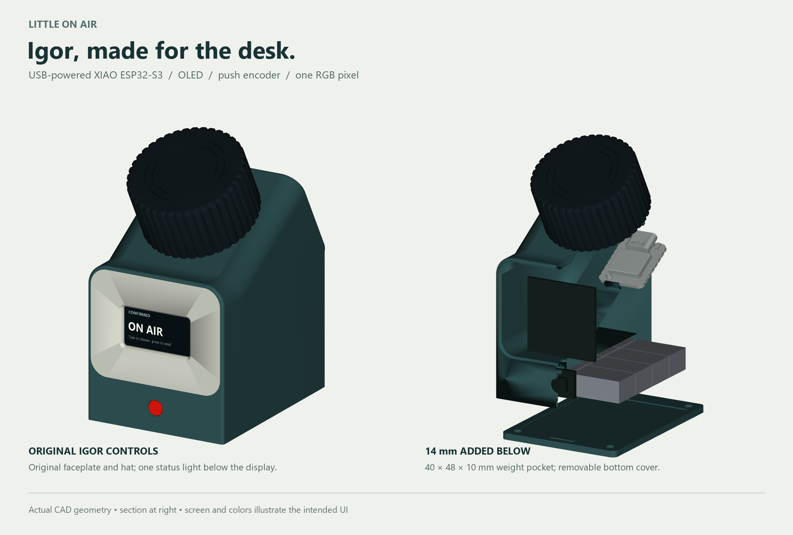

# Little On Air — Igor desk controller v1

**Superseded by [revision 3](../igor-flat-base-v3/README.md):** this revision used an incorrect desk orientation. Use revision 3 for the flat base, horizontal encoder and front NeoPixel.

**Superseded:** use the [minimal Igor revision 2](../igor-minimal-v2/README.md), which preserves the original shape and adds only a small base extension, XIAO holder and top LED spot.

A **USB-powered XIAO ESP32-S3 controller** with an OLED, a rotary push encoder,
one WS2812B RGB LED, and a weighted case. This is a direct modification of
[Project IGOR by UrbanCircles / Peter](https://www.printables.com/model/1019283-project-igor-open-source-offline-loyal-cheerful-fo),
using the creator's STEP geometry from [UrbanCircles/igor](https://github.com/UrbanCircles/igor).



## What changed

- **Computer USB-C supplies all power.** Use the regular XIAO ESP32-S3, without
  the Sense expansion board. No controller battery or external charger.
- Igor's **original OLED faceplate and encoder hat are retained at 100% size**.
  The assembled hat has a nominal 0.6 mm clearance above the shell.
- The original sloping underside is extended downward to a **flat desk base**.
  It adds **14 mm below the original front floor** and fills the space beneath
  the original rear slope. The upper silhouette and encoder mount remain Igor's.
- A **40 × 48 × 10 mm** underside compartment accepts adhesive wheel weights.
  The example arrangement is sixteen 5 g segments, **80 g total**, in two layers.
  Each segment must be **at most 19 × 11.5 × 4 mm, including adhesive**.
- A separate front slot holds a **10 × 10 × 1.6 mm single-pixel PCB**, behind a
  captive diffuser. The removable bottom cover retains the pixel PCB and weights.
- The D1 mini ridge is removed. A new XIAO pedestal, forward stop and enlarged
  rear USB opening fit the **actual Seeed XIAO ESP32-S3 CAD model**. Thin mounting
  tape holds the board down; the stop takes the forward insertion load.

Overall assembled envelope, excluding cable and rubber feet: approximately
**49 × 67.3 × 90.2 mm** (width × depth × height, including the hat).
Fit four approximately Ø8 × 1.2 mm rubber feet to the bottom cover for grip.

## Files to use

| File / folder | Purpose |
| --- | --- |
| [output/stl](output/stl) | Five individual parts, already oriented for printing, in millimetres |
| [output/bambu-studio](output/bambu-studio) | Three Bambu X1C / 0.4 mm projects, separated by material/color |
| [Complete STEP assembly](output/cad/igor-desk-v1.step) | Editable solid assembly; individual STEP parts are alongside it |
| [BOM.csv](BOM.csv) | Electronics, fasteners, weights and consumables |
| [ASSEMBLY.md](ASSEMBLY.md) | Printing, component fit, wiring routes and assembly |
| [WIRING.md](WIRING.md) | ESP32-S3 pin assignment and electrical connections |
| [FIRMWARE.md](FIRMWARE.md) | Controller behavior and required firmware migration |
| [output/validation](output/validation) | Native fit, manifold meshes and actual slicer results |

Print **one of each**: shell, faceplate, hat, ballast cover, diffuser. The source
Igor 3MF also contains decorative hat inlay rings; these are not needed for this
five-part build. Do not print the files in `assembly-meshes` as a print plate:
they retain assembly coordinates and include non-printable reference hardware.

## Verification and current status

**Hardware design and fabrication files are complete for a first prototype.**
All five meshes are watertight, consistently wound, connected solids. Native
solid checks find no interference between printed parts, the XIAO board model,
the declared USB plug envelope, the pixel envelope or the example weights. The
XIAO insertion path and the uninterrupted roof over the weight pocket are checked.
All three projects were actually sliced in Bambu Studio without warnings.

The original OLED and KY-040 mounts still require a fit check against the
particular modules purchased. Wiring, radio range, optical diffusion, encoder
force, insert fit and desk stability require a physical prototype. No physical
print, electrical test or hardware flash has been performed.

**The repository's existing controller firmware still targets the nRF52840.**
This hardware iteration does not make that UF2 compatible with the ESP32-S3.
The screen shown above illustrates the intended UI. See [FIRMWARE.md](FIRMWARE.md).
The receiver and its v2.13 enclosure remain the existing design.

## Rebuild

Use Python 3.12, `requirements.txt`, and the committed original STEP. From this
directory:

```sh
python -m pip install -r requirements.txt
python run_cad.py build
python run_cad.py validate_fit
python prepare_prints.py
python render_views.py
```

`prepare_prints.py` uses the installed Windows Bambu Studio executable and the
saved project profiles. It slices locally and never sends a print to a printer.
The CAD worker handles an observed Windows native-library teardown fault by
exiting after successful export/check completion; any assertion or exception
still fails the job. The renderer uses the exported CAD meshes, not AI imagery.

## Attribution

Upstream commit: `7543085fe11f102f121f08aabd8f6c25c38bdf60`.
The original files and UrbanCircles' MIT license are preserved in `upstream`.
See [SOURCES.md](SOURCES.md) for exact origins and the Seeed reference model.
The modifications and build scripts use this repository's MIT license; the
third-party files retain their original notices.
