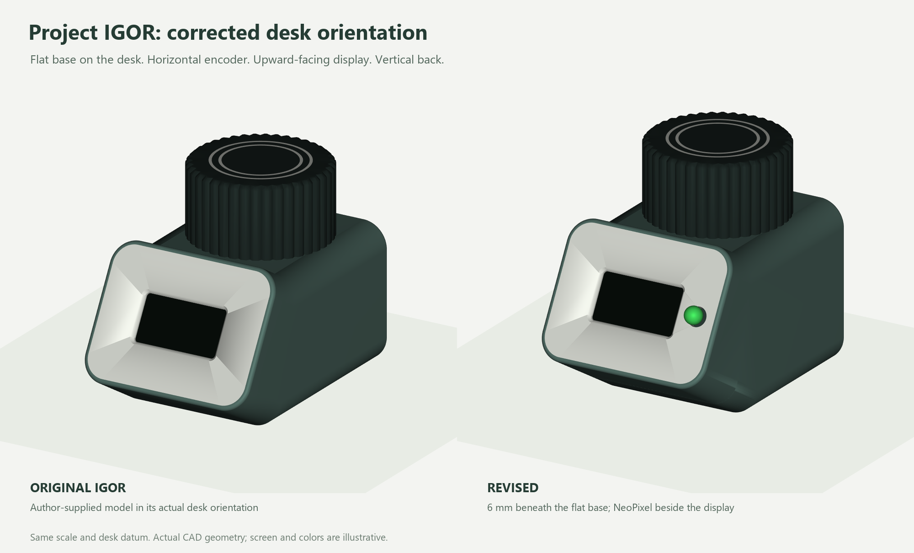
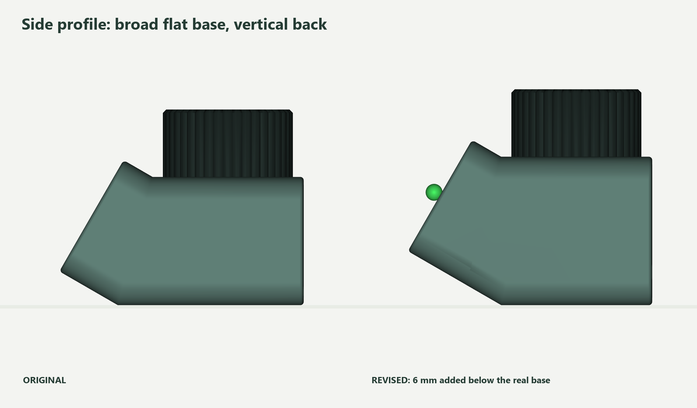

# Project IGOR controller — corrected flat-base revision 3

**Superseded by [measured revision 4](../igor-measured-v4/README.md)**, which
fits the supplied weights, encoder, OLED and mini-strip LED with a diffuser.

The **large flat base sits on the desk**, the **encoder is horizontal**, the
**display faces upward at 60° to the desk**, and the **back is vertical**.
This revision starts from the original author-supplied STEP in that orientation.
It supersedes revisions 1 and 2, which misinterpreted the bottom.



## Minimal alterations

- **6 mm beneath the actual flat base.** One internal **36 × 20 mm** well holds
  three adhesive 5 g segments, each at most **19 × 11.5 × 4 mm including tape**.
  The raised front nose has no weights. The original rounded front underside
  continues smoothly into the added depth.
- **XIAO ESP32-S3 holder.** A shallow pocket and small mounting pad replace the
  D1-mini holder. USB uses the original rear position with a small opening
  enlargement to **9.8 × 4.6 mm**.
- **NeoPixel on the front face.** A **5.4 mm round opening** beside the display
  and an internal shoulder accept a **5 mm through-hole NeoPixel**. The original
  display opening, OLED mounting arrangement and faceplate closure remain.

The original hat, inlays and encoder mount are unchanged. The top has no LED
opening. There are still three main printed parts and two optional original
inlays, with no additional cover or case fasteners.



## Print and CAD files

- [Shell STL](output/stl/01-igor-flat-base-shell.stl)
- [Front LED faceplate STL](output/stl/02-igor-front-led-faceplate.stl)
- [Assembled STEP](output/cad/igor-flat-base-v3.step)
- [Bambu shell and original hat project](output/bambu-studio/igor-flat-base-v3-X1C-PLA-shell-hat.3mf)
- [Bambu faceplate and original inlays project](output/bambu-studio/igor-flat-base-v3-X1C-PLA-face-inlays.3mf)
- [Assembly guide](ASSEMBLY.md) · [BOM](BOM.csv) · [Wiring](WIRING.md)
- [Original source and attribution](SOURCES.md)

If you already have Igor, print the revised shell and LED faceplate and reuse
the original hat. STLs are oriented for printing. STEP uses the desk frame
with the original base at Z=0 and revised bottom at Z=-6. Comparison renders
place each assembly on the desk to show the real 6 mm height increase.

## Verification and limits

Native checks explicitly verify the horizontal base, vertical encoder axis and
vertical back. They confirm the raised nose is unchanged and edits are confined
to the base, XIAO holder/USB opening or small front LED mount. All five STLs are
closed, connected solids. Fit checks cover Seeed's XIAO model, sampled insertion
paths, the front pixel/lead envelope, OLED clearance, three weights and USB.

Both Bambu projects slice successfully without warnings. These are digital
checks: a physical print and soldered-module assembly still need a prototype
check. The pixel format has changed to fit beside the existing OLED; check its
dimensions and color order in [WIRING.md](WIRING.md).
See [validation records](output/validation/package-audit.json).

The controller remains computer-powered. This mechanical iteration does not
port the repository's nRF52840 firmware; see [firmware status](FIRMWARE.md).

## Rebuild

Install `requirements.txt`, then run from this directory:

```text
python run_cad.py build
python run_cad.py validate_fit
python prepare_prints.py
python render_views.py
python package.py
```

The slicer check requires Bambu Studio on Windows. `run_cad.py` reports errors
normally and avoids an OpenCascade interpreter teardown fault after completed
work. The exact source STEP and reproducible CAD operations are included.
