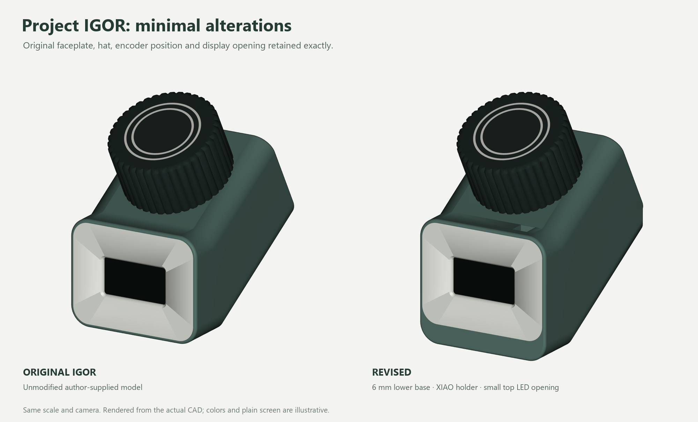
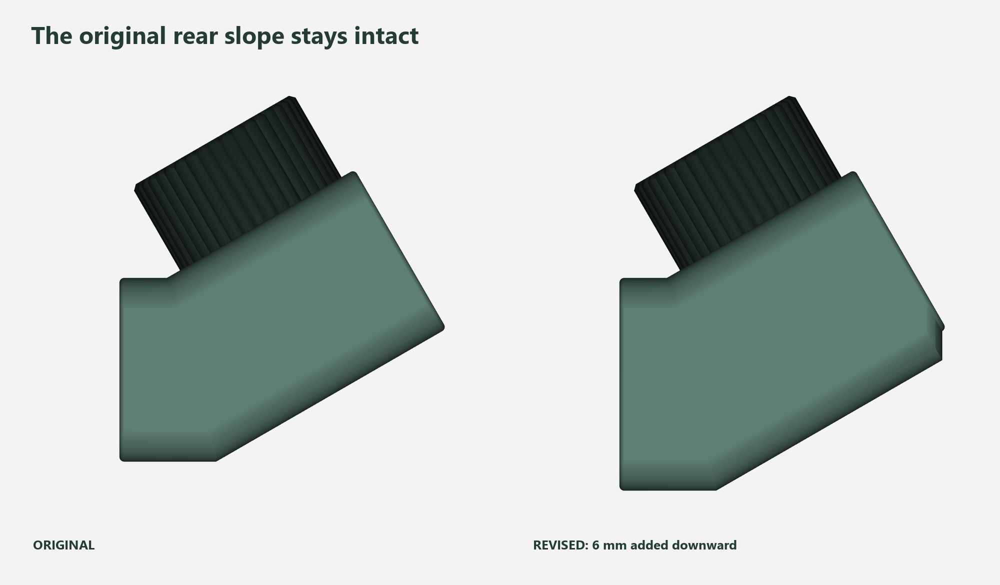

# Project IGOR controller — minimal revision 2

**Superseded by [revision 3](../igor-flat-base-v3/README.md):** this revision used an incorrect desk orientation. Use revision 3 for the flat base, horizontal encoder and front NeoPixel.

This version starts again from **UrbanCircles’ original Project IGOR STEP**.
Only the shell changes. The original faceplate, hat, two decorative inlays,
screen opening, encoder position and front closure geometry are preserved exactly.



## The three alterations

| Change | Detail |
| --- | --- |
| Extend the base slightly | Original underside swept **6 mm downward**, following its existing rounded edges and 30° rear slope. Two internal recesses hold **five adhesive 5 g weight segments**, up to **19 × 11.5 × 4 mm each including tape**. |
| Replace the D1-mini holder | A shallow XIAO ESP32-S3 pocket and small mounting pad. Its USB-C socket stays centered at the original rear opening; that opening grows only to **9.8 × 4.6 mm**. |
| Add one LED spot | A **5.6 × 5.6 mm opening on the top**, ahead of the hat, with three small internal locating/glue lands for a **10 × 10 mm WS2812B carrier**. |

No additional case screws, bottom cover or diffuser. Use adhesive-backed weights
in a single layer. If you already have an Igor, reuse its faceplate and hat;
**only the new shell needs printing**.



## Files

- [Revised shell STL](output/stl/01-igor-shell-minimal.stl)
- [Complete assembled STEP](output/cad/igor-minimal-v2.step)
- [Bambu shell + original hat project](output/bambu-studio/igor-minimal-v2-X1C-PLA-shell-hat.3mf)
- [Bambu original faceplate + inlays project](output/bambu-studio/igor-minimal-v2-X1C-PLA-face-inlays.3mf)
- [Assembly and printing](ASSEMBLY.md) · [BOM](BOM.csv) · [Wiring](WIRING.md)
- [Original model provenance and attribution](SOURCES.md)

The five STLs are oriented for printing. The original inlays are optional trim
from the source design. The Bambu projects contain editable geometry/settings;
select your printer and filament and slice again before printing.

## Verification

Native solid comparisons confirm **zero change** to all four original separate
parts, and **zero shell changes outside the three edit regions**. All five STLs
are closed, valid, connected solids. The manufacturer’s XIAO model fits; sampled
socket-first insertion, LED fit and five nominal weights clear the shell.
Both Bambu projects slice successfully without warnings at 0.2 mm / four walls.

These are CAD and slicer checks. A physical print, soldered-module fit and cable
fit still need a first-prototype check. Exact purchased weight and LED carrier
dimensions matter. See [validation records](output/validation/package-audit.json).

This is a mechanical revision. The USB-powered ESP32-S3 electronics plan is
unchanged; the repository’s current controller firmware still targets nRF52840.
See [firmware migration status](FIRMWARE.md).

## Rebuild

Install the pinned dependencies in `requirements.txt`, then run from this directory:

```text
python run_cad.py build
python run_cad.py validate_fit
python prepare_prints.py
python render_views.py
python package.py
```

The print check uses an installed Bambu Studio on Windows. Model dimensions and
features are defined in `build.py`; the source STEP is bundled byte-for-byte.
`run_cad.py` reports build exceptions normally and avoids an OCP interpreter
teardown fault on Windows after the completed checks and file writes.
