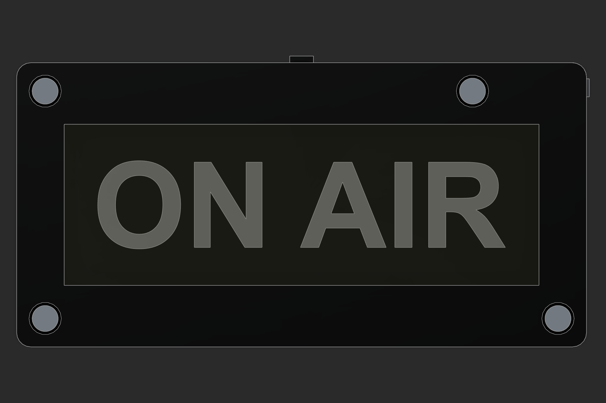
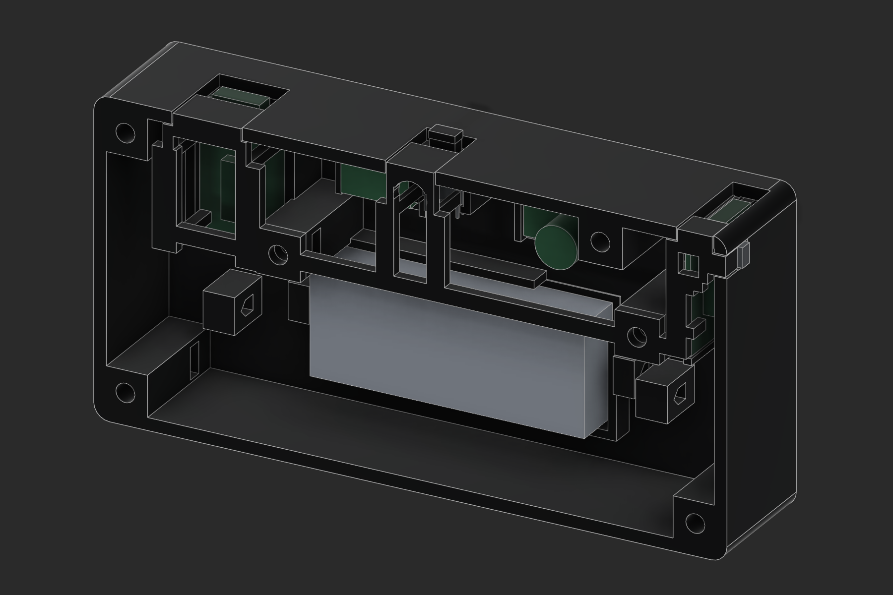
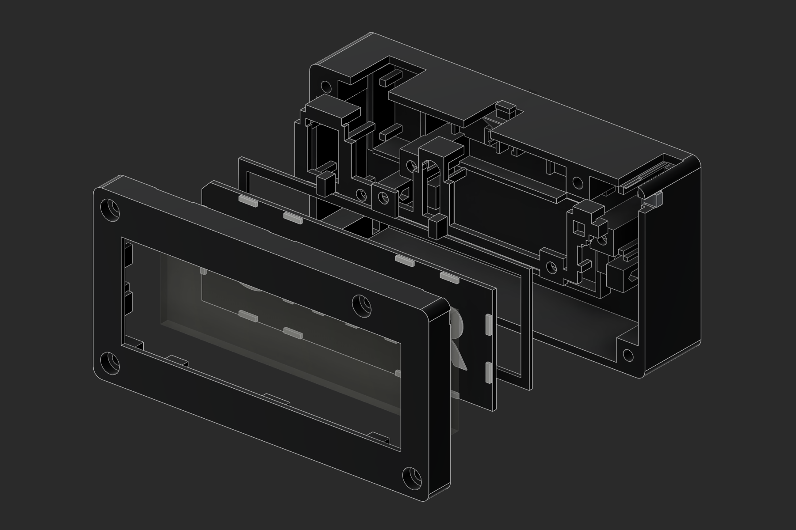
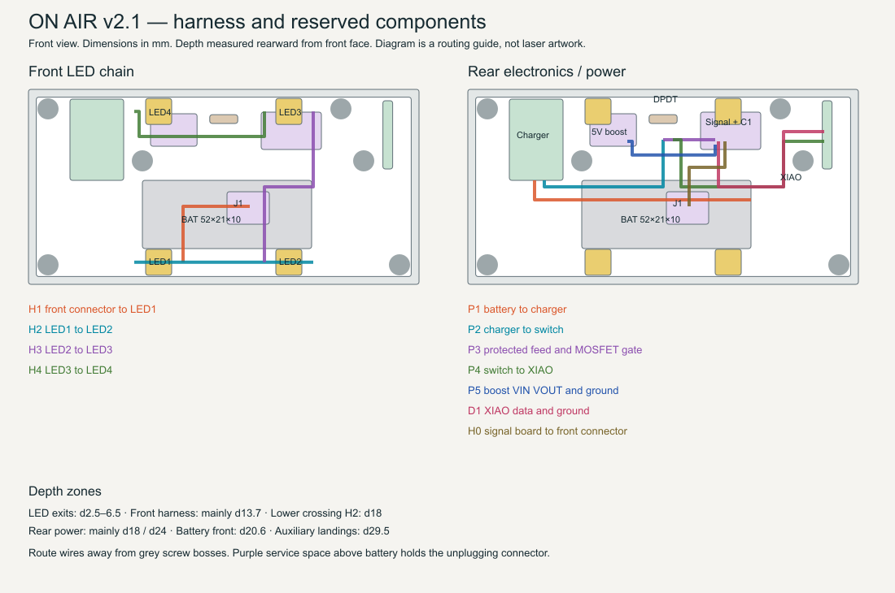

# ON AIR v2.1 — manufacturing and wiring

**Selected electrical build:** read the switch-rating update in [Simplified battery wiring](SIMPLIFIED-BATTERY-WIRING.md) and [its provisional BOM](BOM-SIMPLIFIED.csv). The identified switch is listed at 100 mA; direct-load wiring requires a suitably rated replacement or a revised electronic switching stage. The printed geometry and optical assembly remain unchanged. The regulated 5 V circuit below is retained as an alternative.

This revision retains the 120 × 60 × 34 mm case, integrated rear holders, seven printed parts and matching acrylic/graphic master. It adds usable solder exits, an open XIAO underside, two auxiliary electrical landings, two strap anchors and larger fastener clearances. Use this complete revision together. Dimensions below are millimetres.

**Release status:** fabrication geometry and the proposed harness can be checked digitally. Actual sheet thickness, cut LED outline, charger populated height, XIAO reset location and printed fits still require the supplied fit samples. The repository's current receiver firmware drives the onboard RGB LED only. It does not yet drive this four-pixel harness. A completed physical sign requires the external-output firmware and the commissioning checks below; no printer, laser or board was commanded to run.

## Parts and retained joints

Print parts 01, 03, 04, 05, 06, 07 and 08. Part 02 is clear acrylic. The rear housing includes battery, charger, XIAO, DPDT and auxiliary board locations. Part 06 is the removable retaining yoke and port roofs. The electronics do not mount on the printed graphic.

| Joint | v2.1 geometry | Fit requirement after printing |
|---|---|---|
| Closure | Four M3 × 25 socket heads from front, into rear captive nuts | Heads fully inset; seam closes by hand before tightening |
| Closure bores / head recesses | Ø3.6 / Ø6.8, head recess 3.2 deep | Screw passes freely; bearing surface clear of brim |
| All eight nut pockets | 6.0 across flats × 3.0 high; nuts nominal 5.5 × 2.4 | Nut slides in without heat or forcing and cannot turn under light screw load |
| Optical retainer | Two M3 × 6 button heads from rear | Retainer ears meet hard seats without bowing acrylic |
| Electronics yoke | Two M3 × 8 button heads from front | Feet restrain padded boards; no pressure on chips or solder joints |
| Printed locating tongues / port caps | Nominal 0.25 clearance at mating sides | Dry assembly without springing walls; remove strings and edge burrs |
| Charger / XIAO / switch lateral fits | Nominal 0.25 per side | Actual boards and case enter freely; use thin insulating shims if loose |
| Keeper axial gaps | About 0.35 at PCB/switch contacts | Add measured compressible nonconductive pads; do not bend boards |
| Reset guide | 4.5 wide × 3.1 deep around 3.8 × 2.4 stem | About 0.35 per side; returns freely after 20 presses |
| Reset travel | 0.2 free play then about 0.3 push; mechanical stop at 0.5 | Confirm against the actual tiny reset switch before powering |
| DPDT fork | 2.10 wide, about 2.10 deep for 1.42 square actuator | About 0.34 per side; both detents reachable with no fork wedging |
| DPDT motion | 2.58 nominal travel from the 4 mm full opening | Check with the actual switch; do not force against the printed stop |
| LED seats | 8.5 lateral opening; optical centre based on 2 mm module | Dry-fit all four cut modules, including remaining copper tabs |
| LED cushions | Retainer contact starts at depth 4.60; nominal LED ends at 4.1875 | About 0.41 allowance for a thin cushion and thickness variation |
| Battery | 54 × 23 cradle for 52 × 21 × 10 pouch | Loose strap, insulated base, no pressure from wires or yoke |

The closure nut cavity is at depth 24.6–27.6. A 25 mm screw bearing at 3.2 ends at 28.2, with 1.0 clearance before the blind bore ends at 29.2. The back is at 34.0, leaving 4.8 solid material behind the bore. Optical and yoke screw lengths remain 6 and 8 mm. All hardware stays inside the case. Use standard heads and nuts of the stated sizes; washers and longer screws change this stack.

For budgeting, require printed mating **surfaces** within ±0.10 of CAD after cleaning and calibration. This is our acceptance criterion, not a published X1C accuracy guarantee. Two opposing printed surfaces can consume 0.20 of a 0.25 clearance. The smallest static joints therefore need the real coupon check, especially with PETG strings or corner curl. For a printed hole/slot, use the measured feature error, rather than counting the same error twice. Do not scale the entire assembly to fix a local fit: the graphic and acrylic registration would also change.

## X1C preparation

Use the supplied X1C 0.4 mm nozzle projects at 100% scale. Each material has AMS, manual-swap and fit-check projects. **PLA-plus-starting is explicitly a Generic PLA starting profile**; PLA+ is a supplier formulation, so select the actual spool's temperature range and calibrate it before printing. PLA and PETG use the installed Bambu factory material presets. Do not mix black PLA and white PETG in the same graphic.

Structural parts use 0.20 layers, four walls, five top/bottom layers, 25% gyroid, conservative outer-wall speed and brims. Small parts are solid. Supports remain off. Rear holders grow from the bed, port roofs grow from the yoke, and the new XIAO opening is open at its printed top. Short internal bridges remain at nut pockets and strap holes. Inspect those bridges and remove hanging strands before inserting hardware. Keep the supplied bed orientations.

The graphic uses a 0.20 first layer and 0.10 thereafter. Black ends at Z=1.6; white starts with the layer ending at Z=1.7. Letter tops end at Z=2.0; hidden spacers reach 2.5. The project includes the one color change or manual pause. An STL carries no colors.

1. Dry the filament using its maker's guidance; calibrate flow and pressure advance for that spool and nozzle.
2. Print the fit-check plate in the intended material. It includes actual production sections, both controls and the complete yoke. Let it cool fully on the plate.
3. Clean brim, first-layer bulges and strings. Check real nuts, screws, both PCBs, switch, reset action and the 31 × 6 acrylic sample. Keep the same orientation/settings for the final parts.
4. Record measured clearances. Correct local hole or contour compensation only from measured results; do not apply an assumed shrinkage percentage. Bambu's documented [hole/contour compensation](https://wiki.bambulab.com/en/software/bambu-studio/xy-hole-contour-compensation) is the relevant control, although its web page was unavailable during this review; the supplied profiles do not invent a compensation value.
5. Print the full parts. Check the 120 mm seam is flat within about 0.2 before tightening. Use hand tools and stop when seated; a numerical torque rating has not been established by testing these printed bosses.

PLA and PLA+ should be used indoors away from hot windows; PETG is the preferred first build here for heat margin. This is a material selection judgment, not a thermal certification. Validate the closed case with the actual charger and light brightness before applying wall strips.

## Nova Plus 24, 60 W RF — acrylic

The user confirmed this machine. Thunder distinguishes its [Nova Plus RF source from the glass-tube Nova](https://www.thunderlaserusa.com/nova-plus-24/). Glass-tube 60 W cutting tables are not an RF preset. Use the machine's installed Thunder RF profile, focus and air-assist procedure from its [manual](https://support.thunderlaserusa.com/portal/en/kb/articles/thunder-laser-nova-plus-rf-machine-user-manual). Do not change controller PWM frequency or machine settings for this sign.

Use confirmed clear PMMA; cast stock usually gives a frosted engraved target. A generic Amazon “1/8 inch” listing does not establish actual thickness, casting process or masking material. Measure at all four corners and the middle. This stack accommodates approximately **3.00–3.45** with measured rear shims/cushions; material outside that range needs a stack revision. Do not force it into the case.

The new retainer contact is at depth 7.725. Its available rear cushion is:

`cushion gap = 0.45 − (measured acrylic thickness − 3.175)`

For 3.00 stock that is 0.625; for 3.175 it is 0.450; for 3.45 it is 0.175. Use thin nonconductive shims plus a compliant layer to fill this gap without bowing the acrylic. The common left/bottom datums align the panel with the graphic; the opposite edges have 0.5 for compliant preload and expansion. A 30°C rise would expand a 104 mm acrylic edge about 0.225 using the acrylic coefficient cited in the earlier design review. Keep expansion clearance instead of gluing all four sides rigidly.

1. Import `91-kerf-plug-and-frame-CUT.svg`, 40 × 30, with zero kerf offset. Its inner square is nominally 20 × 20. Cut the inner contour first, using a verified RF acrylic setting and the same sheet/lens/focus as production. Measure the loose plug P and opening H in both axes. Estimated full kerf is `(H − P) / 2`; also compare `20 − P` and `H − 20`. Disagreement indicates taper, measurement error or an inaccurate cut. Measure both top and bottom surfaces and use the larger interference risk for fit.
2. For the production **outside** outline, apply an outward path offset of half the measured full kerf. Check its direction in LightBurn Preview. Do not offset or scale the text. The file itself contains zero compensation. This follows the method in [LightBurn's kerf guide](https://docs.lightburnsoftware.com/latest/Guides/Test-KerfOffset/).
3. Use `92-engraving-quality-nine-samples-FILL.svg` on scrap, rear face up. It has nine independently colored samples and fine bars. Start from a proven RF clear-acrylic engraving setting. Compare line intervals 0.10, 0.125 and 0.15 across the columns, and modestly lower/base/higher engraving energy down the rows. These intervals are a test range, not certified settings: Thunder quotes about 0.128 mm nominal spot size for a 2-inch Nova Plus lens under its test conditions. [Thunder spot-size reference](https://support.thunderlaserusa.com/portal/en/kb/articles/thunder-laser-beam-waist-matrix)
4. Choose a shallow, uniformly frosted fill with no ridges, cracks or melted lip. A target depth around 0.05–0.15 is a design aim to test, not a prediction from power percentage. Keep broad surfaces clear. Record speed, min/max power, interval, focus, passes, lens and air settings in `COMMISSIONING.csv`. Power/speed remain test-dependent; no unverified machine job is supplied.
5. Import `02-acrylic-REAR-engrave-and-cut.svg` at exactly **104 × 38**. Rear side faces the laser. Text **and key are already mirrored**. Blue = Fill, engrave first; red = Line, outline last. Do not mirror again. Use the tested compensation only on red. Preview to verify counters stay clear and the outline is cut once.
6. Flip the finished panel left-to-right. ON AIR reads normally and the clipped corner is upper left. Keep the four LED entry areas smooth and clean. Do not frost these edges or cover them with adhesive. Test the panel and matching graphic in their shared datums before fitting the retainer.

The optional `02-acrylic-REVIEW-ONLY.lbrn2` has the same geometry, blue Fill before red Line, both outputs disabled and all min/max powers set to zero. Its remaining speed/interval fields are placeholders. The existing LightBurn device profile was disconnected and was not confirmed to be the RF profile. Select your verified Nova Plus RF device and successful scrap settings before enabling output; the SVG remains the machine-independent master.

The graphic's integral spacing pads retain about 0.5 air between white letter tips and the unengraved acrylic rear plane. The engraving is recessed into that plane. Avoid adhesive across the clear face or filling the air gap. Blacken visible side faces of the white printed spacing pads if they show at oblique angles. Optional laser-safe black-over-white laminate still uses its separate unmirrored SVG and both optional spacer rings; measure its actual 1.6 thickness and adjust the rear cushion accordingly.

## Electrical design and additional parts

The four parts are Adafruit side-light NeoPixels. The exact strip SKU remains unconfirmed: Adafruit's [120 LED/m strip](https://www.adafruit.com/product/3634) is listed at 8 mm pitch but 10 mm strip width, while other versions differ. The 8 × 8 × 2 user measurements govern this CAD. **Print the LED fit section before the bezel**; confirm the entire cut segment fits and the emitting side aligns with the acrylic. Keep each pixel's original small SMD capacitor. Do not cut through its solder pads or bypass its internal driver.

The proposed external circuit uses a **5 V Pololu U3V16F5 boost regulator**, a **TI SN74AHCT1G125 buffer**, a **DMP1045U P-channel MOSFET**, a **680 µF capacitor rated at least 6.3 V**, **100 nF ceramic bypass**, **330 Ω series data resistor**, **two 100 kΩ resistors**, and a **12 kΩ replacement charger current-setting resistor**. See `BOM.csv` for quantities, space limits and which parts are already owned. NeoPixels contain their channel current regulation; do not add three LED current resistors per pixel.

The boost has a documented footprint about 13.1 × 8.1 and height up to 3.0. Its modeled envelope is 13.2 × 8.1 × 3.0 on the left auxiliary landing. [Pololu specification](https://www.pololu.com/product/4941) The right landing accepts a **17 × 10 × 1 carrier** with insulated underside. Use direct wiring or a purpose-made carrier within that envelope: tall headers and a full-size DIP buffer board will not fit. The maximum capacitor body is **Ø8 × 11.5**; check the chosen part's drawing. Its leads and the carrier bring the total inside the reserved 13 mm depth. The two SOT-23 devices and small passives occupy the separate 7 × 9 area beside it. Secure both assemblies with thin insulating adhesive and a nonconductive retaining strip onto their landings, keeping service pads accessible.

Adafruit recommends a series data resistor and supply reservoir capacitor, and level shifting for 5 V pixels driven from 3.3 V. Here the 330 Ω resistor goes **near LED1**, insulated inline in route H1. The 680 µF capacitor goes across 5 V/GND at the signal board, with correct polarity. [Adafruit electrical guidance](https://learn.adafruit.com/adafruit-neopixel-uberguide/best-practices)

The single-gate AHCT device accepts a 3.3 V logic high when supplied at 5 V. Connect pin 5 VCC to boosted 5 V, pin 3 GND to protected ground, pin 1 /OE to ground, pin 2 A to XIAO **D2 / P0.28** and pin 4 Y to the front DATA lead. Put 100 nF directly between pins 5/3 and a 100 kΩ pulldown from A to ground. Its specified input leakage includes VCC=0, allowing the MCU-side input during USB programming with LED power off. Do not substitute a generic bidirectional I²C level shifter. [TI pinout and electrical table](https://www.ti.com/lit/ds/symlink/sn74ahct1g125.pdf)

The tiny DPDT's unconfirmed rating should not carry the LED boost current. Q1 instead switches that branch: **source to charger OUT+, drain to boost VIN, gate to the DPDT control common**. A 100 kΩ gate-to-source resistor holds Q1 off while the switch moves. Q1 is DMP1045U in SOT-23; verify source/drain against its drawing. At a 0.5 A design budget, its 45 mΩ maximum specified at −2.5 V gives approximately 0.011 W conduction loss, excluding switching transients. [Diodes datasheet](https://www.diodes.com/datasheet/download/DMP1045U.pdf)

## Exact connection list

Use the pad markings and a continuity meter. A through-hole DPDT's physical leg order cannot be inferred from its case dimensions. Identify each pole's common and the two throws before soldering, then label the selected positions **RUN** and **OFF/CHARGE**.

| From | To |
|---|---|
| Battery positive / negative | Charger B+ / B−, permanently |
| Charger OUT− | XIAO BAT−/GND, boost GND, buffer GND, front GND; common protected ground |
| Charger OUT+ | Pole A RUN throw, Q1 source, Rgate source end, pole B OFF throw |
| DPDT pole A common | XIAO BAT+ |
| DPDT pole A OFF throw | Unconnected and insulated |
| DPDT pole B common | Q1 gate |
| DPDT pole B RUN throw | Protected ground |
| Q1 drain | Boost VIN |
| Boost VOUT | Buffer VCC, C1 positive, front +5 V |
| C1 negative | Protected ground |
| XIAO D2/P0.28 | Buffer A; 100 kΩ from A to ground |
| Buffer Y | Front connector DATA → 330 Ω near LED1 → LED1 DIN |
| LED1 DOUT → LED2 DIN → LED2 DOUT → LED3 DIN → LED3 DOUT | Next pixel DIN, ending at LED4 DIN |
| Pixel +5 V / GND | Continuous corresponding rails through all four pixels |
| LED4 DOUT | Unconnected and insulated |

The front connector is a polarized **three-contact inline connector**, with a measured assembled body no larger than 13 × 10 × 7.5. Assign cavity numbers GND, +5 V, DATA and mark both halves; do not assume third-party pigtail colors. It rests in the service space above the battery, not in a side seam. A bulky JST-SM connector may exceed this space. Keep soldering on the module pads and use flexible pigtails rather than headers through the boards.

The TP4056 board stays connected to the cell through B+/B−; route the load through OUT+/OUT− so its protection is retained. Do not join B− to OUT− externally. The [specified Amazon board](https://www.amazon.com/dp/B07PKND8KG) is advertised as 25 × 16.5 and up to 1 A charging; the actual board revision and its protection function must be checked on the bench.

## Charging, programming and current budget

| Mode | DPDT | USB connection |
|---|---|---|
| Normal sign | RUN | Both USB cables unplugged |
| Charge cell | OFF/CHARGE | Charger USB only |
| Program receiver | OFF/CHARGE | XIAO USB only; charger USB unplugged |

In OFF/CHARGE, the XIAO BAT+ is disconnected and Q1 turns the boost off. Both grounds remain referenced. This avoids charging a live load through a simple TP4056 and avoids paralleling it with the XIAO's onboard charger. The design does **not** provide automatic simultaneous USB operation/charging or a USB interlock. Its mode table is part of the build. Supporting arbitrary USB combinations would require a different power-path circuit.

For this uncharacterized 1000 mAh cell and enclosed charger, start at **100 mA**, not the board's advertised 1 A. Replace the TP4056 PROG-to-GND resistor with **12 kΩ, 1%**, after identifying the actual IC and existing resistor. Do not add it in parallel. The [manufacturer TP4056 table](https://www.umw-ic.com/static/pdf/1c10411cf0937f9f813d2f3f7dea7cda.pdf) gives the 12 kΩ/100 mA relationship; check the specific board's IC and measure actual current. Capacity alone does not specify the cell's permissible charging rate. At 5 V input and a 3 V cell, 100 mA gives roughly 0.2 W linear dissipation. Expect more than ten hours from empty including the constant-voltage phase, not a one-hour fast charge.

The existing XIAO onboard charger is approximately 50/100 mA configurable; this circuit does not use it for normal charging. [Seeed battery guidance](https://wiki.seeedstudio.com/XIAO_BLE/) Some charger boards lack USB-C CC resistors. Test the intended cable; if C-to-C fails, use a known USB-A-to-C supply or qualify the board's CC repair separately. Do not bridge CC1/CC2. No unverified USB connector modification is included in the build.

Budget 4 × 60 mA = 240 mA at 5 V for an older NeoPixel full-white worst-case estimate, about 1.2 W. At 3.2 V and 85% conversion efficiency that is about 0.44 A battery-side, plus the XIAO and idle losses. Q1 carries this branch. At a 12.5% software ceiling, the dynamic LED portion is about 30 mA at 5 V; pixel idle current and converter losses remain. Confirm actual draw and color balance rather than claiming a battery runtime from those estimates. The boost's low-voltage operation is not cell protection; the protected cell/charger cutoff is necessary.

## Routing and assembly

Coordinates in `routing-map.svg` are as viewed from the front. Depth increases from the front face. H1–H4 are the front NeoPixel chain: lower-left → lower-right → upper-right → upper-left. Place each pixel with its emitting face toward the acrylic and follow its DIN/DOUT marking, even when that reverses its wire direction.

The checked main harness envelope is Ø3.2; use flexible 28 AWG wire with **insulated OD ≤0.9** for the LED/power harness. Use 30 AWG, OD ≤0.8, for the low-current XIAO branch and signal pair in their Ø2.4 corridor. Three 0.9 wires fit comfortably in Ø3.2; a shared four-wire 0.8 bundle fits within Ø2.4. Do not substitute thick silicone wires based solely on AWG. The LED side exits carry three leads flat, approximately 3.1 wide × 1.1 thick. Keep each solder fillet inside the cutout. Individual near-pad turns use about 2.5 nominal bend allowance; relax the wire bends rather than creasing insulation. Main routes have rounded corners and space around the wires.

The independent packing check compares every pair of sampled wire routes, using compact wire cross sections plus 0.2 placement allowance. P4/D1 intentionally share a four-wire trunk. Other close approaches occur only in the marked termination spaces (with a 2 mm dressing margin), where the individual wires must fan out to their pads. This does not model every solder joint. Keep P1 along Y26 at depth18; P4 moves forward to depth18 before crossing the auxiliary feeds at depth24; H0 moves forward to depth13.7 before crossing P1. Follow these depth changes, not just the projected lines in the map.

Routes above the pouch stay forward of its front surface, including the detachable connector. No wire goes under the cell. The DPDT has a reserved solder space at X56.2–63.8, Y42.5–46.4, depth18.5–25.3; trim legs only after continuity identification, then insulate each joint individually. Row-to-row clearance is small: use heat shrink with finished OD around 1.2 or less at the six terminals. Keep the actuator and fork free.

1. Make and test the auxiliary circuit on the bench with a current-limited supply. Measure 5 V output before connecting pixels; inspect capacitor and Q1 orientation.
2. Print and fit the hardware samples; laser-test and measure the acrylic. Do the LED fit first if its SKU is uncertain.
3. Solder three flexible wires at each used LED side. Retain each original SMD part. Install the 330 Ω resistor near LED1 and insulate it. Place LEDs in their seats, using the new side reliefs; hold the pigtails with small insulating tape bridges away from emitting faces.
4. Assemble acrylic, printed graphic, edge preload and measured rear cushions. Fit the optical retainer. Check lighting before joining the case halves.
5. Side-load all captive nuts. Solder the charger/XIAO/switch leads before installation. Keep XIAO underside joints within its new open access window and off the end supports. Dress USB-side solder and confirm cable overmolds clear their ports.
6. Seat the battery on its insulating pad and fit a loose strap. Seat the PCBs, reset plunger, slider and DPDT in the stated order: XIAO before reset; slider before switch; yoke last. Secure the two auxiliary assemblies to their insulating landings.
7. Lay the rear power wires along the indicated routes and secure them to the integrated strap anchors. Use local service slack at terminations, not tight straight leads. Place the front connector above the battery with enough slack to unplug before removing the front completely. `wire-cut-list.csv` includes 20 mm dressing allowance; trim only after a dry closure.
8. Install the yoke and its two 8 mm screws. Check that no keeper foot, port cap or screw sits on insulation. Operate reset 20 times and the DPDT through both detents 20 times. Tug cable shells gently; board movement should be imperceptible.
9. Join the front connector with power off. Lay H1–H4 clear of the optical screws and the seam; use the routing map. Bring halves together by hand while observing the last few millimetres. Do not use the four closure screws to pull a pinched harness into place.
10. Install the four 25 mm closure screws until seated. Complete the electrical, optical and temperature commissioning record. Apply removable wall strips to the flat rear only after those checks pass.

The auxiliary/component envelopes and insertion checks are digital clearance studies, not physical assembly or electrical tests. The exact solder fillets, cable overmolds, material shrinkage, adhesive creep and switch force are not measured by Fusion. Blender was unnecessary for this revision: native solids and independent exported-mesh checks provide the geometry validation.

## Firmware and commissioning gate

The current `status_output_pwm.c` and board overlay only configure the onboard RGB LED. D2/P0.28 is the proposed new NeoPixel data pin, not an already functioning output. Before declaring this sign operational, implement/select a receiver NeoPixel driver with four RGB pixels in the correct color order and 800 kHz protocol, keeping the existing status-output interface. Preserve pairing, reset handling and the 12.5% brightness ceiling. This fabrication revision does not change or flash firmware.

On a current-limited bench supply, verify OFF/RUN isolation, Q1 switching, regulated voltage, no backfeed at either unused USB port, four-pixel order, all status colors, reset return and charger termination with the load disconnected. Measure closed-case cell and case temperatures at the intended brightness and during charging at 20–25°C ambient; use **40°C cell/case as this build's conservative acceptance target**, or the cell maker's lower limit. This is a test target, not a thermal simulation. Finish the hardware acceptance checks in the repository after external-output firmware is installed.

## Assembly illustrations

CAD geometry views do not predict lighting brightness or printed finish.

