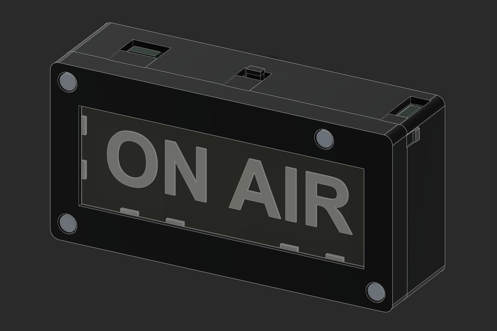

# ON AIR v2.1 — start here

**Electrical update:** the identified DPDT is listed at 100 mA. Read the [switch-rating finding](SIMPLIFIED-BATTERY-WIRING.md) before wiring; the simplified direct-load circuit needs a suitably rated replacement switch or an electronic switching stage. The fabrication geometry is unchanged.

120 × 60 × 34 mm enclosure, with fixed electronics holders integrated into the flat rear housing. Use this entire revision together; previous plate layouts are superseded.

1. Read [Build and assembly](BUILD-AND-ASSEMBLY.md), [the selected simplified wiring](SIMPLIFIED-BATTERY-WIRING.md) and [its BOM](BOM-SIMPLIFIED.csv). This build uses battery-powered pixels, an inline data resistor, a bulk capacitor and your pigtail disconnects. The original regulated 5 V circuit is retained as an alternative.
2. Open [PETG fit checks](bambu-studio/on-air-v21-X1C-PETG-fit-checks.3mf) first, or the PLA / PLA-plus-starting equivalent. Use the real LEDs, boards, switch, fasteners and measured acrylic scrap to qualify fit.
3. Open [PETG AMS main project](bambu-studio/on-air-v21-X1C-PETG-AMS.3mf), or the matching manual-swap / material alternative. All projects target the X1 Carbon with a 0.4 mm nozzle. Plate 1: bezel and rear housing. Plate 2: optical retainer, retaining yoke, reset and slider. Plate 3: black-and-white graphic. Keep 100% scale and the supplied orientations.
4. Use [rear-engraved acrylic SVG](laser/02-acrylic-REAR-engrave-and-cut.svg) in LightBurn, exactly 104 × 38 mm. It is already mirrored. Engrave blue Fill first; cut red Line last. Qualify the supplied kerf and engraving samples on your Nova Plus 24 / 60 W RF machine. The optional native LightBurn file is review-only, with outputs off and powers zero.
5. Assemble using the exact connection table and electrical checks in [Simplified battery wiring](SIMPLIFIED-BATTERY-WIRING.md). The old [routing map](routing-map.png) shows available corridors, but its endpoints and cut list describe the alternative 5 V circuit. Use the mechanical checks in [the commissioning record](COMMISSIONING.csv) and the simplified note’s electrical checks before wall mounting.

Separate meshes are in `stl/`; editable Fusion and STEP are in `cad/`. The two rings in `optional-laminate/` belong only to the optional laser laminate backing. The eight `fit-samples/` are clipped production sections, not extra assembly parts. Their Bambu plate also includes the complete yoke and both controls.

[Validation record](VALIDATION.md): all 17 meshes passed topology checks, 13 assembly/control paths passed, and all 9 Bambu projects sliced without warnings. These are digital results. Physical fit, wiring, thermal behavior and RF material settings still require the supplied tests. Existing receiver firmware is onboard-LED-only; external NeoPixel firmware is a remaining operational step.

