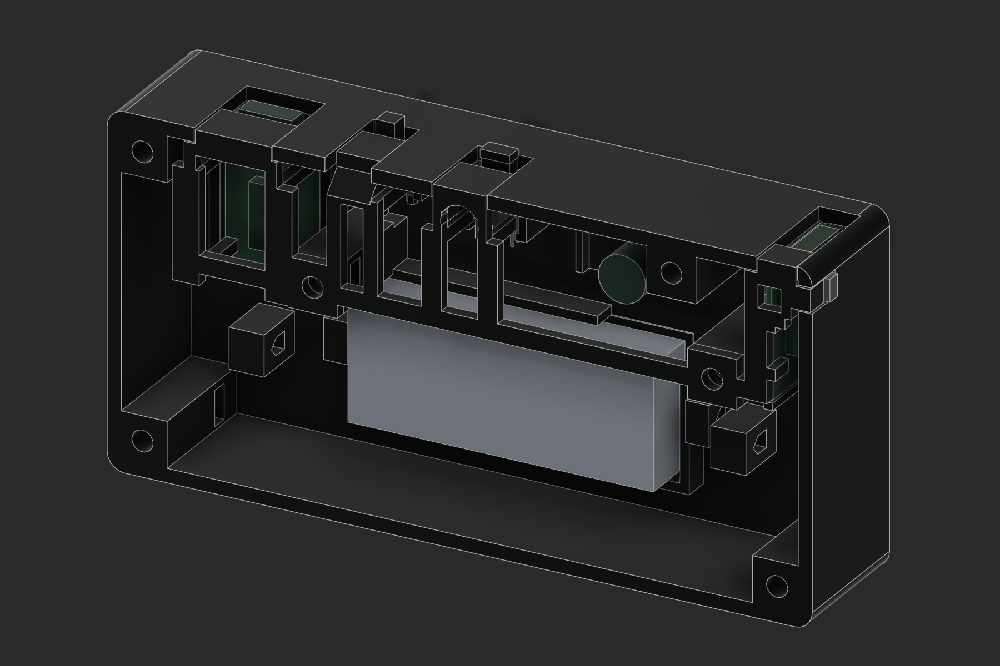
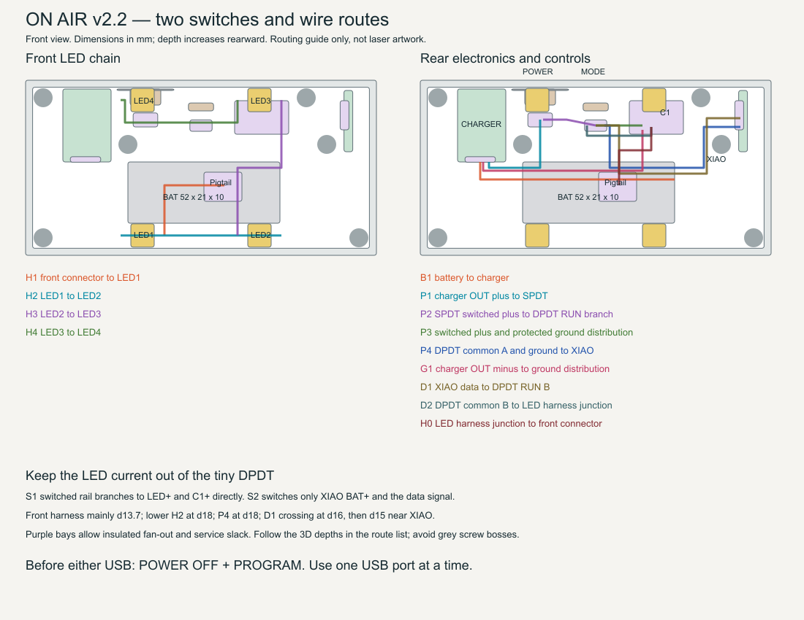

# ON AIR v2.2 — two-switch enclosure and assembly

The 120 × 60 × 34 mm housing now holds both switches you already own. S1 is the larger SPDT POWER switch; S2 is the tiny DPDT RUN/PROGRAM switch, operated by the existing captive printed slider. The revised rear housing (05) and yoke (06) capture S1 without another bracket, printed button or screw. The front optics, graphic, fasteners and flat wall-mounting back retain their previous dimensions.

Use this revision's wiring table and routing map together. It contains only the selected direct-battery circuit, inline 330 Ω data resistor, 680 µF capacitor and your pigtails. The unused booster landing has been cleared for the POWER mount. The right landing remains useful for securing the insulated capacitor and wire junctions.

The mechanical release is a digitally checked prototype. Print the fit plate first, especially sample 98 for the larger switch. The existing receiver firmware still controls the onboard RGB LED; a four-NeoPixel output remains an operational task. No board was flashed and no printer or laser job was started.

## What to reprint

If you already printed v2.1, replace **05 Rear electronics housing** and **06 Electronics retaining yoke** together. Part 08 has only been renamed RUN PROGRAM; its shape is unchanged. The bezel, graphic backing, optical retainer, reset plunger and laser artwork retain their geometry. The fit plate has nine clipped production samples plus the full yoke and both printed controls, twelve objects total. They are test pieces, not twelve additional assembly parts.

## Switch mounting and placement

Viewed from the front, POWER is on the top at X=41 mm, immediately left of RUN/PROGRAM at X=60 mm. The POWER switch's own 5 mm lever projects about 2 mm above the case. Its main body is located at X35.75–46.25, Y51.5–57.0, depth20.0–25.7. Solder terminals point inward, toward the empty routing area. Its flange slides in from the open front before the yoke is installed.

The [Tnuocke SS12F15-G5 listing](https://www.amazon.com/dp/B099N3HFPG?th=1) has a [dimension drawing](https://m.media-amazon.com/images/I/61bomash9uL._SL1500_.jpg) showing a 19.5 mm flange, 10.5 mm body length, 5.7 mm body depth, 5.5 mm body height, 5 mm lever and 2.5 mm legs. The side-view lever is 2.9 mm; CAD reserves a conservative 3.2 mm square. Its actual other-axis knob width and travel remain unmeasured. The nominal travel study uses 3.0 mm end-to-end. The wider aperture is deliberate; sample 98 must confirm both detents with clearance and no flange interference. Do not force a different switch revision into this seat.

The original [WMYCONGCONG DPDT](https://www.amazon.com/dp/B07F7PNDGM) retains the measured 8.6 × 3.1 × 2.7 mm case, 1.42 mm square actuator and 2.58 mm travel inferred from the confirmed 4 mm total opening. Use sample 94 with part 08 and the full yoke to check its travel. The POWER roof has a 45-degree underside ramp to clear the existing bezel tongue and build from the yoke's print bed surface.

Label S1 OFF / ON and S2 PROGRAM / RUN after checking continuity. Choose the connected throws so rightward motion, viewed from the front, selects ON and RUN. Identify the actual contacts with a meter; lever direction need not correspond to the nearest physical terminal. The controls remain accessible with the flat back against a wall.

## Parts and retained joints

Print parts 01, 03, 04, 05, 06, 07 and 08. Part 02 is clear acrylic. The rear housing includes battery, charger, XIAO, DPDT RUN/PROGRAM and SPDT POWER locations. Part 06 is the removable retaining yoke and port roofs. The electronics do not mount on the printed graphic.

| Joint | v2.2 geometry | Fit requirement after printing |
|---|---|---|
| Closure | Four M3 × 25 socket heads from front, into rear captive nuts | Heads fully inset; seam closes by hand before tightening |
| Closure bores / head recesses | Ø3.6 / Ø6.8, head recess 3.2 deep | Screw passes freely; bearing surface clear of brim |
| All eight nut pockets | 6.0 across flats × 3.0 high; nuts nominal 5.5 × 2.4 | Nut slides in without heat or forcing and cannot turn under light screw load |
| Optical retainer | Two M3 × 6 button heads from rear | Retainer ears meet hard seats without bowing acrylic |
| Electronics yoke | Two M3 × 8 button heads from front | Feet restrain padded boards; no pressure on chips or solder joints |
| Printed locating tongues / port caps | Nominal 0.25 clearance at mating sides | Dry assembly without springing walls; remove strings and edge burrs |
| Charger / XIAO / switch lateral fits | Nominal 0.25 per side | Actual boards and case enter freely; use thin insulating shims if loose |
| Keeper axial gaps | About 0.35 at PCB/switch contacts | Add measured compressible nonconductive pads; do not bend boards |
| Reset guide | 4.5 wide × 3.1 deep around 3.8 × 2.4 stem | About 0.35 per side; returns freely after 20 presses |
| Reset travel | 0.2 free play then about 0.3 push; mechanical stop at 0.5 | Confirm against the actual tiny reset switch before powering |
| DPDT fork | 2.10 wide, about 2.10 deep for 1.42 square actuator | About 0.34 per side; both detents reachable with no fork wedging |
| DPDT motion | 2.58 nominal travel from the 4 mm full opening | Check with the actual switch; do not force against the printed stop |
| SPDT POWER body pocket | 11.1 × 6.1 for 10.5 × 5.5 nominal body | 0.30 per side; 0.35 front keeper gap, use thin insulating cushion |
| SPDT POWER lever opening | 7.9 × 3.9 for a conservative 3.2 square lever envelope | Nominal 3.0 travel; opening permits up to 4.7 geometric travel before side contact, without added end clearance |
| SPDT flange and terminals | 19.5 wide flange; 2.5 long terminals | No flange screw required; actual part held between integrated seat and removable yoke |
| LED seats | 8.5 lateral opening; optical centre based on 2 mm module | Dry-fit all four cut modules, including remaining copper tabs |
| LED cushions | Retainer contact starts at depth 4.60; nominal LED ends at 4.1875 | About 0.41 allowance for a thin cushion and thickness variation |
| Battery | 54 × 23 cradle for 52 × 21 × 10 pouch | Loose strap, insulated base, no pressure from wires or yoke |

The closure nut cavity is at depth 24.6–27.6. A 25 mm screw bearing at 3.2 ends at 28.2, with 1.0 clearance before the blind bore ends at 29.2. The back is at 34.0, leaving 4.8 solid material behind the bore. Optical and yoke screw lengths remain 6 and 8 mm. All hardware stays inside the case. Use standard heads and nuts of the stated sizes; washers and longer screws change this stack.

For budgeting, require printed mating **surfaces** within ±0.10 of CAD after cleaning and calibration. This is our acceptance criterion, not a published X1C accuracy guarantee. Two opposing printed surfaces can consume 0.20 of a 0.25 clearance. The smallest static joints therefore need the real coupon check, especially with PETG strings or corner curl. For a printed hole/slot, use the measured feature error, rather than counting the same error twice. Do not scale the entire assembly to fix a local fit: the graphic and acrylic registration would also change.

## X1C preparation

Use the supplied X1C 0.4 mm nozzle projects at 100% scale. Each material has AMS, manual-swap and fit-check projects. **PLA-plus-starting is explicitly a Generic PLA starting profile**; PLA+ is a supplier formulation, so select the actual spool's temperature range and calibrate it before printing. PLA and PETG use the installed Bambu factory material presets. Do not mix black PLA and white PETG in the same graphic.

Structural parts use 0.20 layers, four walls, five top/bottom layers, 25% gyroid, conservative outer-wall speed and brims. Small parts are solid. Supports remain off. Rear holders grow from the bed, port roofs grow from the yoke, and the new XIAO opening is open at its printed top. Short internal bridges remain at nut pockets and strap holes. Inspect those bridges and remove hanging strands before inserting hardware. Keep the supplied bed orientations.

The graphic uses a 0.20 first layer and 0.10 thereafter. Black ends at Z=1.6; white starts with the layer ending at Z=1.7. Letter tops end at Z=2.0; hidden spacers reach 2.5. The project includes the one color change or manual pause. An STL carries no colors.

1. Dry the filament using its maker's guidance; calibrate flow and pressure advance for that spool and nozzle.
2. Print the fit-check plate in the intended material. It includes actual production sections, both controls and the complete yoke. Let it cool fully on the plate.
3. Clean brim, first-layer bulges and strings. Check real nuts, screws, both PCBs, both switches, reset action and the 31 × 6 acrylic sample. Keep the same orientation/settings for the final parts.
4. Record measured clearances. Correct local hole or contour compensation only from measured results; do not apply an assumed shrinkage percentage. Bambu's documented [hole/contour compensation](https://wiki.bambulab.com/en/software/bambu-studio/xy-hole-contour-compensation) is the relevant control, although its web page was unavailable during this review; the supplied profiles do not invent a compensation value.
5. Print the full parts. Check the 120 mm seam is flat within about 0.2 before tightening. Use hand tools and stop when seated; a numerical torque rating has not been established by testing these printed bosses.

PLA and PLA+ should be used indoors away from hot windows; PETG is the preferred first build here for heat margin. This is a material selection judgment, not a thermal certification. Validate the closed case with the actual charger and light brightness before applying wall strips.

## Nova Plus 24, 60 W RF — acrylic

The user confirmed this machine. Thunder distinguishes its [Nova Plus RF source from the glass-tube Nova](https://www.thunderlaserusa.com/nova-plus-24/). Glass-tube 60 W cutting tables are not an RF preset. Use the machine's installed Thunder RF profile, focus and air-assist procedure from its [manual](https://support.thunderlaserusa.com/portal/en/kb/articles/thunder-laser-nova-plus-rf-machine-user-manual). Do not change controller PWM frequency or machine settings for this sign.

Use confirmed clear PMMA; cast stock usually gives a frosted engraved target. A generic Amazon “1/8 inch” listing does not establish actual thickness, casting process or masking material. Measure at all four corners and the middle. This stack accommodates approximately **3.00–3.45** with measured rear shims/cushions; material outside that range needs a stack revision. Do not force it into the case.

The retainer contact is at depth 7.725. Its available rear cushion is:

`cushion gap = 0.45 − (measured acrylic thickness − 3.175)`

For 3.00 stock that is 0.625; for 3.175 it is 0.450; for 3.45 it is 0.175. Use thin nonconductive shims plus a compliant layer to fill this gap without bowing the acrylic. The common left/bottom datums align the panel with the graphic; the opposite edges have 0.5 for compliant preload and expansion. A 30°C rise would expand a 104 mm acrylic edge about 0.225 using the acrylic coefficient cited in the earlier design review. Keep expansion clearance instead of gluing all four sides rigidly.

1. Import `91-kerf-plug-and-frame-CUT.svg`, 40 × 30, with zero kerf offset. Its inner square is nominally 20 × 20. Cut the inner contour first, using a verified RF acrylic setting and the same sheet/lens/focus as production. Measure the loose plug P and opening H in both axes. Estimated full kerf is `(H − P) / 2`; also compare `20 − P` and `H − 20`. Disagreement indicates taper, measurement error or an inaccurate cut. Measure both top and bottom surfaces and use the larger interference risk for fit.
2. For the production **outside** outline, apply an outward path offset of half the measured full kerf. Check its direction in LightBurn Preview. Do not offset or scale the text. The file itself contains zero compensation. This follows the method in [LightBurn's kerf guide](https://docs.lightburnsoftware.com/latest/Guides/Test-KerfOffset/).
3. Use `92-engraving-quality-nine-samples-FILL.svg` on scrap, rear face up. It has nine independently colored samples and fine bars. Start from a proven RF clear-acrylic engraving setting. Compare line intervals 0.10, 0.125 and 0.15 across the columns, and modestly lower/base/higher engraving energy down the rows. These intervals are a test range, not certified settings: Thunder quotes about 0.128 mm nominal spot size for a 2-inch Nova Plus lens under its test conditions. [Thunder spot-size reference](https://support.thunderlaserusa.com/portal/en/kb/articles/thunder-laser-beam-waist-matrix)
4. Choose a shallow, uniformly frosted fill with no ridges, cracks or melted lip. A target depth around 0.05–0.15 is a design aim to test, not a prediction from power percentage. Keep broad surfaces clear. Record speed, min/max power, interval, focus, passes, lens and air settings in `COMMISSIONING.csv`. Power/speed remain test-dependent; no unverified machine job is supplied.
5. Import `02-acrylic-REAR-engrave-and-cut.svg` at exactly **104 × 38**. Rear side faces the laser. Text **and key are already mirrored**. Blue = Fill, engrave first; red = Line, outline last. Do not mirror again. Use the tested compensation only on red. Preview to verify counters stay clear and the outline is cut once.
6. Flip the finished panel left-to-right. ON AIR reads normally and the clipped corner is upper left. Keep the four LED entry areas smooth and clean. Do not frost these edges or cover them with adhesive. Test the panel and matching graphic in their shared datums before fitting the retainer.

The optional `02-acrylic-REVIEW-ONLY.lbrn2` has the same geometry, blue Fill before red Line, both outputs disabled and all min/max powers set to zero. Its remaining speed/interval fields are placeholders. The existing LightBurn device profile was disconnected and was not confirmed to be the RF profile. Select your verified Nova Plus RF device and successful scrap settings before enabling output; the SVG remains the machine-independent master.

The graphic's integral spacing pads retain about 0.5 air between white letter tips and the unengraved acrylic rear plane. The engraving is recessed into that plane. Avoid adhesive across the clear face or filling the air gap. Blacken visible side faces of the white printed spacing pads if they show at oblique angles. Optional laser-safe black-over-white laminate still uses its separate unmirrored SVG and both optional spacer rings; measure its actual 1.6 thickness and adjust the rear cushion accordingly.

## Selected electrical circuit

S1, the larger SPDT, disconnects the sign's load from the protected battery output. S2, the tiny DPDT, separately isolates the XIAO battery input and data output for USB work. The battery remains connected to the charging board when POWER is off; this is a hard disconnect for the sign load, not a zero-leakage battery-storage disconnect.

The four NeoPixels run directly from the single-cell battery rail, labelled **VBAT_SW**, rather than a regulated 5 V supply. Adafruit describes a 3.7 V LiPo supply with 3.3 V logic as a usable configuration. This simplification gives battery-dependent brightness and less voltage margin as the cell discharges. Check the actual pixels over the intended operating range; do not assume every unidentified NeoPixel revision behaves identically. [Adafruit basic connections](https://learn.adafruit.com/adafruit-neopixel-uberguide/basic-connections)

Keep the selected **330 Ω data resistor** near the first pixel and **680 µF capacitor, rated at least 6.3 V**, across the switched pixel rail. The resistor is in series with DATA; the capacitor is in parallel across power, with its negative lead on protected ground. Keep the pixels' existing SMD components. No boost board, logic buffer, MOSFET or separate signal carrier is required by this selected circuit. [Adafruit resistor and capacitor guidance](https://learn.adafruit.com/adafruit-neopixel-uberguide/best-practices)

The SPDT listing rates its contacts at 0.5 A; the DPDT listing is 100 mA. An older-pixel conservative estimate is 4 × 60 mA = 240 mA at full white, plus the MCU branch. This is a paper budget, not a measurement at battery voltage. **Wire LED+ and C1+ directly to the S1 switched rail, before S2.** The tiny switch carries only the MCU branch and signal. Confirm MCU branch current, including startup, remains below 100 mA. Keep a 12.5% initial brightness ceiling and measure actual current. [Adafruit power estimates](https://learn.adafruit.com/adafruit-neopixel-uberguide/powering-neopixels)

The 0.5 A SPDT listing does not specify capacitive-load inrush. Charging 680 µF can briefly exceed steady LED current; a DC steady-current rating alone does not qualify this transient. Test the actual switch/startup behavior and inspect for contact sticking or bounce-related resets. This remains a bench qualification of the parts you own, rather than a reason to add a switching module to the enclosure. [TI explanation of capacitive inrush](https://www.ti.com/lit/an/slva670a/slva670a.pdf)

## Exact connections

Disconnect the battery while soldering. Find both switches' commons and throws with a continuity meter. Do not infer pin numbers from the drawing or assume slider direction matches the nearest terminal. A refers to one isolated DPDT pole; B refers to the other.

| From | To |
|---|---|
| Cell positive and negative | Charger B+ and B−, permanently |
| Charger OUT+ | S1 POWER common |
| S1 ON throw | VBAT_SW junction |
| S1 OFF throw | Unconnected and insulated |
| VBAT_SW junction | LED power pigtail, C1 positive, S2 pole A RUN throw |
| S2 pole A common | XIAO BAT+ |
| S2 pole A PROGRAM throw | Unconnected and insulated |
| XIAO D2 / P0.28 | S2 pole B RUN throw |
| S2 pole B common | Front DATA pigtail → 330 Ω near LED1 → LED1 DIN |
| S2 pole B PROGRAM throw | Unconnected and insulated |
| Charger OUT− | XIAO BAT−/GND, C1 negative and LED GND; permanent common protected ground |
| LED1 DOUT → LED2 DIN; LED2 DOUT → LED3 DIN; LED3 DOUT → LED4 DIN | Daisy-chain DATA in this order |
| All four pixel power pads | VBAT_SW, continuous corresponding power rail |
| All four pixel ground pads | Protected ground, continuous corresponding ground rail |
| LED4 DOUT | Unconnected and insulated |

Keep charger B− separate from OUT− outside the board so the protection is not bypassed. Mark the user-supplied pigtails **GND, VBAT_SW, DATA**, checking both halves with a meter. A pixel pad marked +5 V still connects to VBAT_SW in this battery-powered build; do not attach a separate 5 V source to that rail.

## Everyday modes

| Action | POWER | MODE | USB |
|---|---|---|---|
| Use the sign | ON | RUN | Both unplugged |
| Turn sign off | OFF | RUN is acceptable | Both unplugged |
| Charge the cell | OFF | PROGRAM | Charger USB only |
| Program the XIAO | OFF | PROGRAM | XIAO USB only |

**Before connecting either USB, switch POWER off and select PROGRAM. Use only that USB port.** Disconnect USB before returning to RUN and turning POWER on. Move MODE only with POWER off and USB removed. PROGRAM is an electrical isolation position; it does not automatically put the XIAO into its bootloader. Use the captive reset button and the firmware's normal upload procedure as needed.

POWER off alone is insufficient for USB programming: in RUN, the XIAO's onboard charging path could feed the shared battery/pixel rail from USB. PROGRAM disconnects both BAT+ and DATA, preventing that intended-route backfeed and data-line parasitic powering. The circuit provides no automatic USB interlock; arbitrary USB/switch combinations are outside this manual operating procedure. [Seeed XIAO battery and charging documentation](https://wiki.seeedstudio.com/XIAO_BLE/)

## Charging and commissioning

The existing HiLetgo TP4056 board is advertised as up to 1 A. A **1000 mAh capacity does not establish the cell's maximum charge current**. Verify the actual board's setting against the cell specification before charging. Retain the existing current-setting resistor only if that setting is appropriate. If the cell's permitted rate is unknown or lower than the measured setting, resolve that before charging; a replacement programming resistor may then be required on the existing board, with no extra enclosure footprint. It is not an unconditional extra BOM item. A confirmed TP4056 commonly uses about 12 kΩ for 100 mA, but verify the IC and actual current after any change. [TP4056 current-setting and termination table](https://www.umw-ic.com/static/pdf/1c10411cf0937f9f813d2f3f7dea7cda.pdf)

Charge only with the load disconnected using the mode table. A simple TP4056 does not manage system load sharing; a live load can interfere with termination. Keep the XIAO USB unplugged during cell charging and the charger USB unplugged during programming. Check the intended USB-C cable works with the particular board revision.

Before final closure, verify continuity and shorts without the cell, capacitor polarity, POWER isolation, both PROGRAM contact openings, correct protected-ground wiring and no connection to unused throws. On the bench, measure startup and steady currents, all four pixel colors/order, dimming and resets as supply voltage falls. Confirm charger termination with the load disconnected. Test the closed case at intended brightness and during charging; use 40°C cell/case at 20–25°C ambient as a conservative build target, or the cell maker's lower limit. This is an acceptance test, not a simulated or certified thermal result.

## Routing and physical assembly

The coordinates in `routing-map.svg` and `validation/harness-validation.json` are viewed from the front; depth increases rearward from the front face. H1–H4 follow LED1 lower-left → LED2 lower-right → LED3 upper-right → LED4 upper-left. Follow actual DIN/DOUT markings even if the wires exit opposite sides on a particular segment. The emitting faces point into the acrylic edges. Keep each pixel's original small SMD component and all solder pads. The measured cut-segment outline, rather than a similar strip photograph, determines fit.

Main LED and battery-pair reservations are Ø3.2. Two-wire MCU/distribution corridors are Ø2.4; individual wires have Ø1.6 clearance corridors. Use flexible insulated wire with OD ≤0.9 mm for 28 AWG LED/power wiring, and OD ≤0.8 mm for 30 AWG low-current MCU/signal wiring. Gauge alone does not determine fit. LED side exits carry three wires flat, with 1 mm lane spacing; the native check uses a 1.1 mm envelope per wire. Insulate solder fillets and keep them out of the optical edge.

Rear routes change depth at crossings: P4 crosses the battery region at depth18, D1 at depth16, and the front harness mainly at depth13.7. Near the XIAO, D1 moves to depth15 before crossing P4. P2/P3 carry the switched supply past the DPDT solder bay to the LED junction; this is a wire splice, **not a feed through the DPDT contact**. Protected ground fans out from G1 to P3/P4 inside the distribution bay. The route paths reserve space; their endpoints are dressing locations, not an assumed switch pinout.

All 78 route pairs are checked using compact insulation radii and 0.2 mm placement allowance. Close paths are allowed only inside the marked termination/service bays with 2 mm dressing margin, where individual insulated wires must fan out. Do not stack junctions directly on top of each other just because their diagram lines meet. Actual solder and connector bodies still require a dry fit.

The capacitor body allowance is Ø8 × 11.5, centred at X84/Y47.5, depth16.2–27.7. Secure it on an insulating pad in the right landing area; its positive and negative leads connect across the switched LED rail. The 330 Ω resistor is insulated inline near LED1, in H1. Keep its finished sleeve diameter within 3.2 mm. Your mated pigtail disconnect should fit the reserved 13 × 10 × 7.5 mm box above the battery, with room for bent wires. Split existing pigtails between smaller bays if necessary and check polarity independently; no connector brand or color code is assumed.

The SPDT solder bay is X36.8–45.2, Y44.0–48.8, depth20.5–25.3. The DPDT bay is X56.2–63.8, Y42.5–46.4, depth18.5–25.3. Clip leads only after identifying contacts. Keep individual DPDT sleeves around 1.2 mm OD or less so the two terminal rows cannot short. No wire goes beneath the cell or through a screw pocket. Keep the antenna end of the XIAO clear of loose conductors.

1. Print and cool the fit-check plate. Clean brim, strings and first-layer bulges. Fit real fasteners, LEDs, boards, acrylic sample, both switches and both controls. Check sample 98 with the complete new yoke; hold it at the same seated depth as the full housing. Both S1 detents must be accessible without forcing the roof or lever.
2. Make a continuity map of both switches before soldering. Mark S1 common/ON/unused and the two independent S2 poles with their common/RUN/PROGRAM contacts. Test the connection table on the bench with the battery disconnected.
3. Laser-test the actual PMMA, then cut and rear-engrave the panel. Solder the LED chain, resistor and pigtails; retain every original SMD part. Tape the wires into their reliefs, away from emitting faces. Assemble acrylic, graphic, edge preload and measured rear cushions, then install the optical retainer with two M3 × 6 button-head screws.
4. Side-load the rear closure and yoke nuts. Solder the switch/board harness while it is accessible. Keep XIAO underside joints within its open window and away from its end supports. Insulate and secure the capacitor and junctions separately on the right landing.
5. Seat the cell on its insulating pad and secure with a loose nonconductive strap. Fit the charger and edge-on XIAO. Insert the reset plunger after the XIAO. Insert the printed RUN/PROGRAM slider, then load the tiny DPDT into its fork from the front.
6. Load the SPDT into the new rear seat from the front, passing its own lever through the open-front top notch. The wide metal flange rests in the surrounding clearance, not underneath a clamp screw. Its three terminals face inward. Add a thin nonconductive cushion at the 0.35 mm keeper allowance if needed; do not pad over the moving lever.
7. Dress the rear wires along the depth-separated routes. Use the existing strap anchors and local service slack. `wire-cut-list.csv` gives initial lengths with allowance; trim after a dry closure. Complete and insulate the S1 rail splice before connecting the DPDT branch and LED branch. Keep the bulk capacitor current path out of S2.
8. Fit the revised yoke last, using its two M3 × 8 button-head screws. Its new arms restrain S1; its removable roof closes the lever notch. Check all USB cable shells insert fully and board movement is imperceptible. Operate reset and both switches twenty times each, checking return/detents and no wire movement into the mechanism.
9. With POWER off and PROGRAM selected, connect the internal pigtail and inspect the final few millimetres of closure. The case must close by hand. Install four M3 × 25 socket-head screws from the front into the rear captive nuts. Never tighten the screws to crush a trapped wire or bowed sheet.
10. Complete the electrical mode, lighting, fit and temperature checks in `COMMISSIONING.csv`. Confirm the current firmware supports the external four-pixel harness before judging lighting. Apply removable adhesive wall strips to the flat rear after the assembled unit passes.

## Validation limits

The native CAD checks nominal solids, sampled insertion paths, control travel and reserved wire volumes. The mesh and Bambu checks verify the exported files and color change. These do not certify actual FDM accuracy, switch force/current capability, cell behavior, solder fillets, plug overmolds, laser finish or illuminated appearance. The fit coupons and commissioning record close those gaps. Blender was not needed because native solid checks and independent STL topology and slicing checks cover this revision's geometry.

The current `status_output_pwm.c` and overlay use the onboard RGB LED. The proposed external pin is D2/P0.28, and a four-pixel 800 kHz NeoPixel driver with the correct color order and brightness limit must be implemented/selected before this sign operates. This enclosure revision does not modify or flash firmware.

