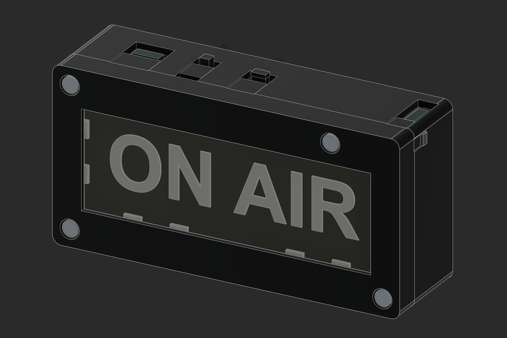

# ON AIR v2.2 — two switches

The larger SPDT is POWER. The original tiny DPDT and captive slider are RUN/PROGRAM. Both are retained by integrated rear holders and one removable yoke. The case remains 120 × 60 × 34 mm with a flat adhesive-mounting back.

**Reprint parts 05 and 06 together if you already made v2.1.** Other main printed shapes and laser artwork are unchanged. Part08 has only been renamed RUN PROGRAM. This package replaces the earlier alternative-circuit wiring instructions.

1. Open [PETG fit checks](bambu-studio/on-air-v22-X1C-PETG-fit-checks.3mf), or the matching PLA / PLA-plus-starting project. Test the actual switches, PCBs, LEDs, fasteners and acrylic. New sample98 checks the POWER mount; its actual lever width and travel are still unmeasured. Nine production sections plus the full yoke and two printed controls make twelve test objects.
2. Open [PETG AMS main print](bambu-studio/on-air-v22-X1C-PETG-AMS.3mf), or its manual-swap/material alternative. Plate1: bezel and rear housing. Plate2: optical retainer, yoke, reset and mode slider. Plate3: registered black/white backing. X1C,0.4 mm nozzle,100% scale; retain supplied orientations. PLA+ is a Generic PLA starting profile requiring spool calibration.
3. Use [rear-engraved acrylic SVG](laser/02-acrylic-REAR-engrave-and-cut.svg) at104 ×38 mm. Already mirrored; blue Fill first, red Line last. Qualify kerf and engraving on the actual PMMA and Nova Plus24 60W RF machine using the supplied test SVGs. The optional LightBurn file is review-only, powers zero and outputs off.
4. Follow [Build and assembly](BUILD-AND-ASSEMBLY.md), the selected [BOM](BOM.csv), [routing map](routing-map.png) and [wire cut list](wire-cut-list.csv). Only the inline330 Ω resistor,680 µF capacitor and your pigtails supplement the existing boards and switches. Check the charger's existing current setting against the cell's rating before charging.
5. Complete [Commissioning](COMMISSIONING.csv) before wall mounting. The existing receiver firmware still needs an external four-NeoPixel output; this revision does not flash or change it.

**Before either USB: POWER OFF, MODE PROGRAM, then connect only the selected USB port.** PROGRAM electrically isolates XIAO BAT+ and DATA; it is not an automatic bootloader command. Disconnect USB before returning to RUN and turning POWER on. LED and capacitor current bypass the tiny DPDT.

Separate STLs are in `stl/`, editable Fusion and STEP in `cad/`. `fit-samples/` are test sections. `optional-laminate/` contains two rings used only for the optional laser-laminate graphic alternative; do not add them to the printed backing stack.

[Validation record](VALIDATION.md): 18 connected watertight STL solids,15 nominal assembly/control paths,40 wire/space checks and9 Bambu projects/21 sliced plates. These digital checks do not replace physical fit and electrical commissioning.

