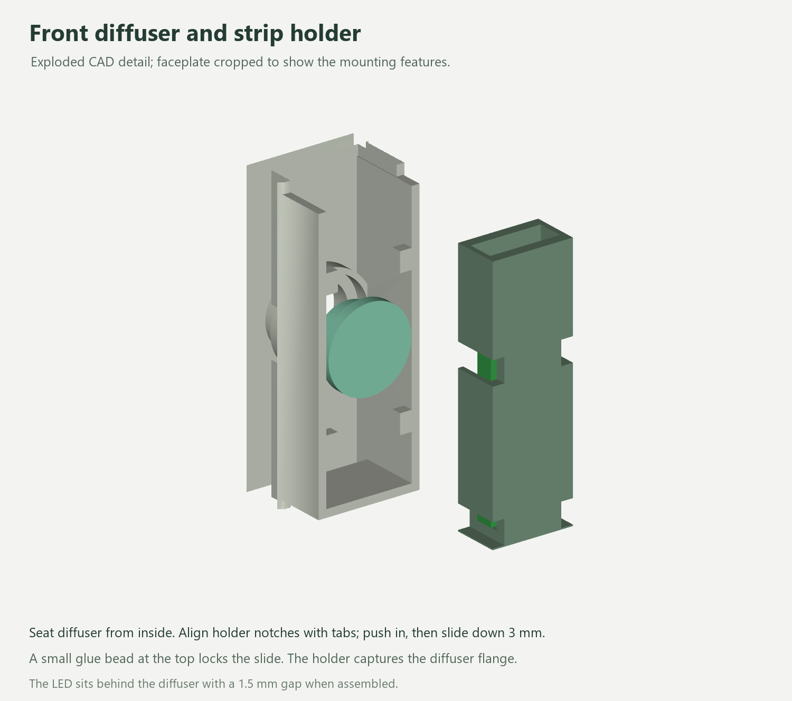

# Print and assembly guide

Use revision 4 parts together. Keep the broad flat base down; the encoder is
horizontal and the display leans upward. Dry-fit before applying adhesive.

## Print

The three supplied Bambu Studio projects use an X1C with a 0.4 mm nozzle:

| Project | Material | Settings |
| --- | --- | --- |
| Shell, knob, XIAO carrier | PLA | 0.2 mm layers, 4 walls, 25% gyroid; supports on shell and knob |
| Faceplate, strip holder, two optional inlays | PLA | Same settings; supports on strip holder |
| Diffuser | Transparent PETG | 0.12 mm layers after 0.2 first layer, 100% infill, 3 walls; no supports |

STLs are oriented for printing. Remove brims and supports carefully, including
the knob socket and strip-holder channel. Check the tiny holder tabs and entry
notches for debris. First-layer scanning is disabled in the projects. Reslice
for your actual printer, plate and filament. The delivered 3MFs are editable
projects; validation sliced copies are used to check printability.

Do not glue the knob to its shaft. Test its D socket first and lightly deburr
if necessary. The two original decorative inlays are optional.

## 1. Encoder before weights

Feed the encoder through the open angled front with the shaft leading into
the shell. Keep it low while turning it upright, then raise it into the roof
hole. The empty base provides room for this maneuver. The five-pin header
faces **forward toward the display**; the registration tab faces rearward.

Seat the metal box in its square locator with a thin adhesive layer at its
upper contact surface (nominal gap 0.25 mm). Hold the shaft centered while it
sets. Add small hot-glue fillets at accessible box/locator edges. Keep glue
away from the rotating shaft, switch and header. PCB solder faces down.
This design uses adhesive retention; no mounting nut or PCB screws are required.

Fit the knob and check rotation and click. At rest its bottom is 1.2 mm above
the roof. The model reserves a 1 mm press, leaving 0.2 mm. Check actual switch
travel before final gluing; remove the knob again while working inside.

## 2. Two wheel weights

Insert each weight through the front above the well and lower it to the floor.
Place them side by side, long dimension front-to-back, with a 0.5 mm gap
between them. Their 6.5 mm height already includes the foam adhesive; add no
extra foam layer. The outer nominal side gaps are 0.25 mm. Press the supplied
adhesive onto a clean floor. No weights go into the raised front nose.

## 3. Carrier and XIAO

Insert the **empty** XIAO carrier through the front, then lower its edges onto
the shell ledges above the weights. Small accessible glue dabs secure it.
The minimum nominal gap from weight tops to carrier underside is 0.7 mm.

Use approximately 0.3 mm insulating mounting tape under the XIAO. Enter low
through the front beneath the encoder, USB socket first, with the board's
front tilted up about 15°. Lower it near the rear opening, slide the socket
through, then lower the front onto its carrier. The PCB fits between the
rails; add small side glue fillets. Keep the reset/boot buttons accessible.

Use soldered wires at the XIAO pads; tall XIAO pin headers are not modeled.
Fit the antenna against upper plastic, clear of weights and the encoder.
Secure and insulate the small level-shifter assembly against the left wall.

## 4. Front subassembly

1. Place the OLED between its edge guides, with the four-pin header at the
   **top/rear** and ribbon at the bottom. Corner stops bear on the PCB front.
   Use small hot-glue dabs on PCB side/corner edges. Keep the glass, ribbon
   loop and bottom notch free of glue. No solder trimming is required by CAD.
2. Insert the transparent PETG diffuser through its hole from behind. The
   larger flange remains inside. An optional tiny dab around its outer flange
   stops rattling; leave the optical faces clean.
3. Slide the mini strip into its holder through the open top, LED facing the
   holder's window. Center the LED on that window. There is a 0.2 mm tape
   allowance behind the strip. Keep solder and strain relief out of the narrow
   channel; route leads from the strip end. The full 17.6 mm length fits.
4. With the strip in place, hold the holder 3 mm above its final position and
   align its edge notches with the four retaining tabs. Push it in from behind,
   then slide it down 3 mm to the bottom stop. The holder now captures the
   diffuser flange. Add a small removable hot-glue bead at the top to prevent
   upward release. No snap-fit flexing is needed.

## 5. Wire, close and check

Follow [WIRING.md](WIRING.md). The encoder and OLED retain their measured
headers. If using plug-on connectors, compare their housings with the allowances
in [FIT-REPORT.md](FIT-REPORT.md); soldered insulated leads may be used instead.
Keep a short service loop clear of the front closure and rotating parts.

Seat the populated faceplate along its normal into Igor's original closure.
Fit the knob/inlays. Check the full display area, free click/rotation, centered
diffuser, stable base and an unobstructed USB plug. Test the LED at low brightness
with red, green and blue separately. Lightly frosting the exposed PETG face is
an optional adjustment if the LED hotspot remains visible.

The component-fit and loading checks are digital. Physical print tolerances,
adhesion, cable routing and optical performance still require this dry-fit and
bench check. The ESP32-S3 application has not yet been ported.
