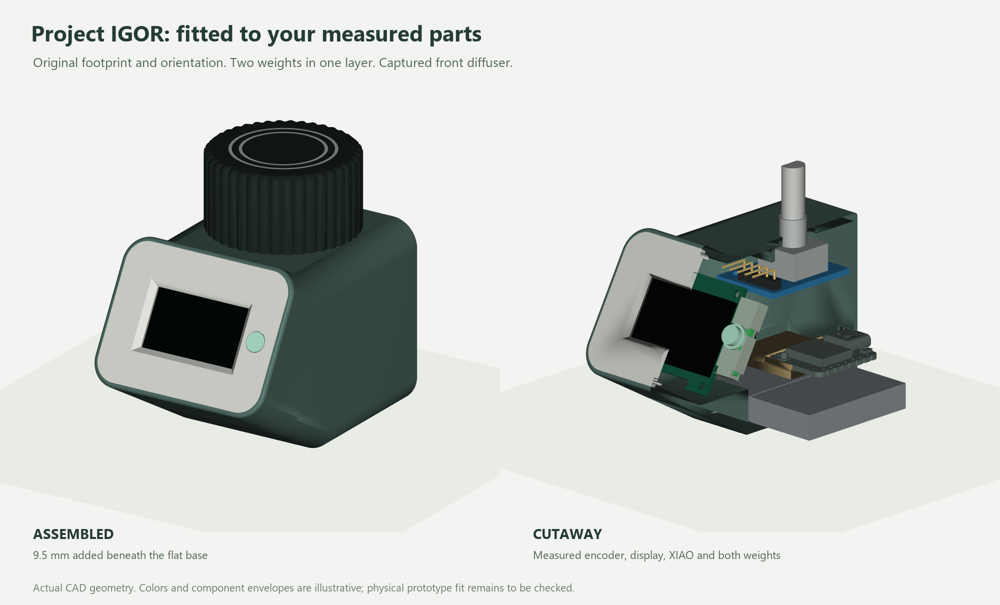
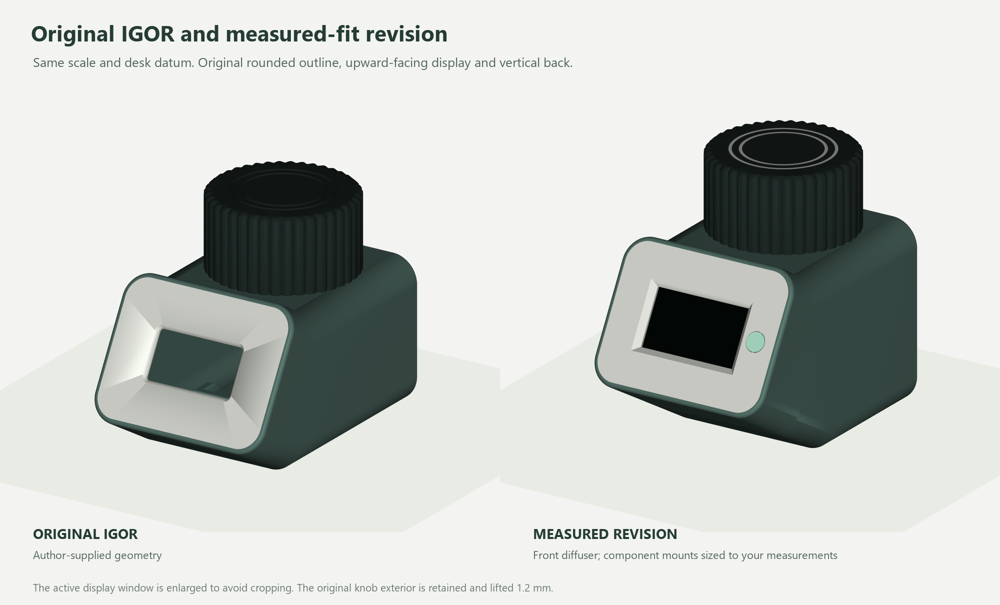

# Project IGOR controller — measured-fit revision 4

This revision fits the supplied component measurements while retaining Igor's
original outline and orientation: **flat base down, horizontal encoder,
upward-facing display and vertical back**. It starts from the author's exact
STEP model and supersedes controller revisions 1–3.



## Changes

- **Two 20 × 33.5 × 6.5 mm weights**, side by side in one layer. The 6.5 mm
  includes their foam adhesive. A **9.5 mm base extension** provides a solid
  floor and clearance beneath the XIAO carrier. Original width and depth are
  retained; the raised front nose contains no weights.
- **Measured encoder mount and knob socket.** A close-fitting box locator
  includes tab clearance; the right-angle header faces forward. The original
  knob exterior is retained, with a new D socket and a 1.2 mm lift to allow a
  1 mm button press. The 5.4 mm shaft measurement is confirmed along the flat.
- **Measured OLED supports.** Edge guides replace the incompatible original
  pegs. The window throat grows to 26.2 × 15.2 mm so the 25.5 × 14.5 mm active
  area is visible. The ribbon, front solder and rear header have clearance.
- **Front mini-strip NeoPixel and transparent PETG diffuser.** The full
  17.6 × 5 × 1.4 mm segment fits a removable holder. A 5 mm visible diffuser
  has a retaining flange captured between the faceplate and holder. Its center
  matches the LED, with a 1.5 mm light-mixing gap.
- **Removable XIAO ESP32-S3 carrier**, above the weights. The rear USB opening
  is 9.8 × 4.6 mm and is raised 1.71 mm from revision 3.



## Files

- [Fit report](FIT-REPORT.md) · [Assembly guide](ASSEMBLY.md) · [BOM](BOM.csv)
- [Assembled STEP](output/cad/igor-measured-v4.step)
- [Shell STL](output/stl/01-igor-measured-shell.stl)
- [Faceplate STL](output/stl/02-igor-measured-faceplate.stl)
- [Knob STL](output/stl/03-igor-measured-hat.stl)
- [Transparent PETG diffuser STL](output/stl/06-front-diffuser-PETG.stl)
- [LED strip holder STL](output/stl/07-strip-cassette.stl)
- [XIAO carrier STL](output/stl/08-xiao-carrier.stl)
- [PLA shell, knob and carrier project](output/bambu-studio/igor-measured-v4-X1C-PLA-shell-hat-carrier.3mf)
- [PLA face, holder and inlays project](output/bambu-studio/igor-measured-v4-X1C-PLA-face-cassette-inlays.3mf)
- [Transparent PETG diffuser project](output/bambu-studio/igor-measured-v4-X1C-transparent-PETG-diffuser.3mf)
- [Wiring](WIRING.md) · [Firmware status](FIRMWARE.md) · [Source attribution](SOURCES.md)

There are eight STLs, including the two optional original decorative inlays.
The revised knob should be printed for this measured shaft. STEP models use
the desk frame, with the original base at Z=0 and the new bottom at Z=-9.5 mm.
STLs are already oriented on the print bed. Reference component meshes are
for inspection, not printing.

## Verification

The parts are valid native solids and closed, connected STL meshes. Digital
checks cover supplied component envelopes, retained headers and solder, knob
motion, component loading, front closure, diffuser capture and the active
display opening. All three Bambu projects slice without warnings. See the
[fit results](output/validation/fit.json) and [package audit](output/validation/package-audit.json).

These are prototype files: printed tolerances, actual switch travel, connector
housings, wiring bends and optical diffusion need a physical check. The measured
pins are modeled; extra connector space is explicitly an allowance. No physical
print test was recorded for this design package. The assembled controller's
[ESP32-S3 firmware](../../../apps/controller-esp32s3/README.md) now has local
electronics bench results; [receiver integration remains to be tested](../../../docs/ESP32S3_BENCH.md).

## Rebuild

Install `requirements.txt`, then run from this directory:

```text
python run_cad.py build
python run_cad.py validate_fit
python prepare_prints.py
python render_views.py
python package.py
```

The slicer check uses Bambu Studio on Windows. `run_cad.py` preserves ordinary
error reporting while avoiding an OpenCascade interpreter teardown fault.
The exact source geometry, measurements and CAD operations are included.
