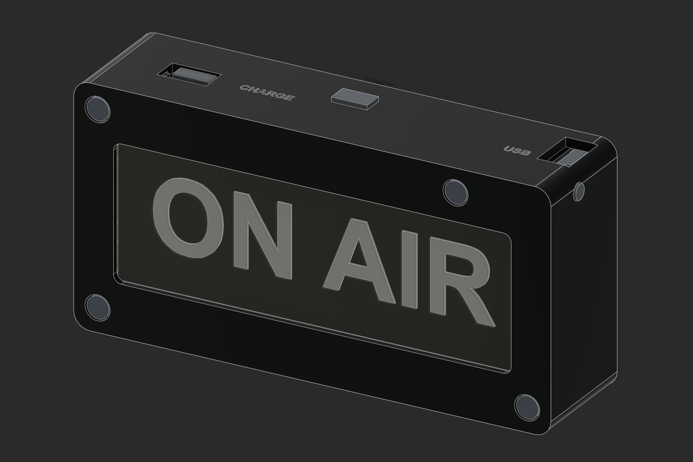
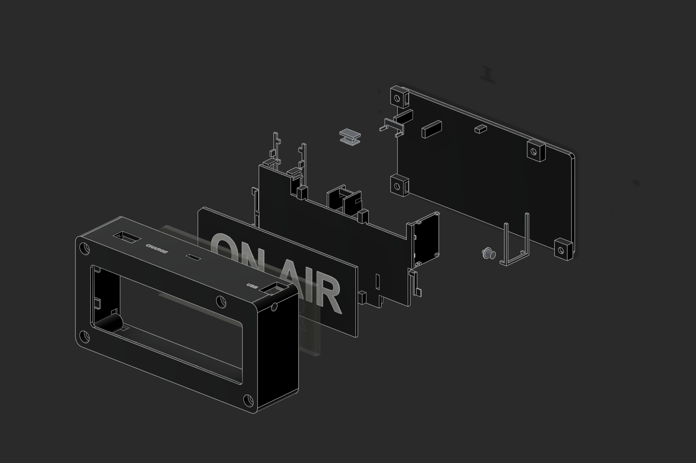

# Little On Air enclosure

**Current case: [v2.15](../../release/little-on-air-enclosure-v2.15/README.md).**
The user retained the case with open-backed frame channels and selected it again
on September 26, 2026. Its original housing and yoke are current along with the
frame. See [the current enclosure guide](README.md).

## Historical v2.16 — rearward LED wiring

The preserved [v2.16 release](../../release/little-on-air-enclosure-v2.16/README.md) changed **05 rear housing and 06 electronics yoke**, reusing the v2.15 front and all other parts. Shallow housing reliefs, reinforced open yoke grooves and one relocated charger contact let separate LED leads turn rearward behind the optical mounts. The [upgrade project](../../release/little-on-air-enclosure-v2.16/bambu-studio/on-air-v216-X1C-upgrade-parts.3mf) prints both parts in black PLA+, about 3 h 06 min / 40.51 g, without supports. Its recorded checks cover all 12 modeled wire paths, their 66 pairwise separations, rigid assembly and both sliced projects; actual pad exits, solder and print fit remain physical checks. This revision is archived rather than selected for the current case.

## v2.15 and v2.14 — wider perimeter wire channels

[v2.14](../../release/little-on-air-enclosure-v2.14/README.md) widened the front to 129 × 69 mm and added perimeter passages. Their roofs failed the user's physical bridge print. [v2.15](../../release/little-on-air-enclosure-v2.15/README.md) opened those channels toward the rear, retaining the other parts. The complete v2.15 case is the current selection.

## Historical v2.13 complete Bambu Studio project

Use the [single four-plate v2.13 project](../archive/enclosure/output/on-air-v213-complete-print/on-air-v213-X1C-all-plates.3mf) for a complete print: black PLA+ enclosure and retainers, black/white PLA+ display backing, and transparent PETG guides. It contains ten production pieces, including the new captive front guide and rear keeper, with no extra fit-size sets. All four plates are sliced and validated. See the [plate and filament guide](../archive/enclosure/output/on-air-v213-complete-print/README.md) for material mapping and the shared first-layer settings. Estimated total: 6 h 14 min / 71.65 g.

## v2.13 — captive light guides

Use the [v2.13 retention package](../archive/enclosure/output/on-air-v213-captive-light-guides.zip). The front guide has an internal collar captured by the frame and existing yoke; one rigid keeper secures both rear guides in keyed seats. Replace **01 front frame, 05 rear housing and 08 front guide**, and add **11 rear guide keeper** with one additional **M3×8 button-head screw and M3 nut**. Existing short rear guides may be reused if they fit freely. The clear-PETG plate now contains exactly **one front and two rear guides**, with no alternate-size copies. Structural parts have a separate PLA+ or PETG plate; only keeper 11 uses automatic support. The wider bevels and all four seam corrections are included. See the [assembly and printing instructions](../archive/enclosure/output/on-air-v213-captive-light-guides/README.md).

## Previous front revision: v2.12 — complete perimeter cleanup

The [v2.12 front package](../archive/enclosure/output/on-air-v212-clean-perimeter-front.zip) closes the fourth legacy notch on the upper right side, while retaining the three top closures and wider bevels. Replace **part 01 only**. An exact perimeter audit covers all four sides and four rounded corners; all pass after correction. Assembly-motion, wiring, mesh and slicing checks also pass. [PLA+](../archive/enclosure/output/on-air-v212-clean-perimeter-front/bambu-studio/on-air-v212-X1C-eSUN-PLA-plus-clean-perimeter-front.3mf) and [PETG](../archive/enclosure/output/on-air-v212-clean-perimeter-front/bambu-studio/on-air-v212-X1C-PETG-clean-perimeter-front.3mf) projects take about 1 h 10 min. See the [revision instructions](../archive/enclosure/output/on-air-v212-clean-perimeter-front/README.md).

## Previous front revision: v2.11 — clean top seam

The [v2.11 front package](../archive/enclosure/output/on-air-v211-clean-top-front.zip) closes three obsolete top-edge notches while retaining the wider v2.10 bevels. Replace **part 01 only**. The existing assembly and light guides remain compatible; the normal 0.15 mm retainer seam clearance is preserved. [PLA+](../archive/enclosure/output/on-air-v211-clean-top-front/bambu-studio/on-air-v211-X1C-eSUN-PLA-plus-clean-top-front.3mf) and [PETG](../archive/enclosure/output/on-air-v211-clean-top-front/bambu-studio/on-air-v211-X1C-PETG-clean-top-front.3mf) projects contain the replacement front, about 1 h 10 min. Native assembly-path, wire-clearance, mesh and slicing checks pass. See the [revision instructions](../archive/enclosure/output/on-air-v211-clean-top-front/README.md).

## Previous front revision: v2.10 — broader bevels

The [v2.10 front package](../archive/enclosure/output/on-air-v210-beveled-front.zip) broadens the outer bevel to **1.4 mm** and the display-opening bevel to **0.8 mm**, both 45°. Replace **part 01 only**; keep the v2.8 assembly and light guides. [PLA+](../archive/enclosure/output/on-air-v210-beveled-front/bambu-studio/on-air-v210-X1C-eSUN-PLA-plus-beveled-front.3mf) and [PETG](../archive/enclosure/output/on-air-v210-beveled-front/bambu-studio/on-air-v210-X1C-PETG-beveled-front.3mf) projects pass slicing checks, approximately 1 h 10 min. The acrylic seat, controls and screw recesses remain unchanged. See the [revision instructions](../archive/enclosure/output/on-air-v210-beveled-front/README.md).

## Previous front revision: v2.9 — subtle bevel

Use the [beveled front package](../archive/enclosure/output/on-air-v29-beveled-front.zip) to replace **part 01 only**. The front has a 0.8 mm outer bevel and a 0.4 mm display-opening bevel, both 45°. [PLA+](../archive/enclosure/output/on-air-v29-beveled-front/bambu-studio/on-air-v29-X1C-eSUN-PLA-plus-beveled-front.3mf) and [PETG](../archive/enclosure/output/on-air-v29-beveled-front/bambu-studio/on-air-v29-X1C-PETG-beveled-front.3mf) projects are sliced and validated, about 1 h 10 min each. Keep the v2.8 housing, optical parts, hardware and light guides. The acrylic seat, controls and screw recesses are unchanged. See the [revision instructions](../archive/enclosure/output/on-air-v29-beveled-front/README.md).

## Previous v2.8 light guides — friction retention, superseded

The v2.13 package above replaces this friction-retained design. Its main optical plate has three required parts; the historical plate below has nine pieces because it includes three fit-size sets. The old exterior-collared front guide is not compatible with the new captive front pocket.

The [light-guide package](../archive/enclosure/output/on-air-v28-light-pipes.zip) adds one front RGB guide and two rear charger guides, with no enclosure reprint. Its [Bambu Studio plate](../archive/enclosure/output/on-air-v28-light-pipes/bambu-studio/on-air-v28-clear-PETG-light-pipes.3mf) contains three complete fit choices (2.95, 3.05 and 3.15 mm shafts), lying flat with verified lengthwise fill. Approximately 29 minutes / 0.98 g. See the [fit and installation instructions](../archive/enclosure/output/on-air-v28-light-pipes/README.md); retention is a close friction fit with stop collars, so physical fit and brightness still need checking.

## Base fabrication release: v2.8 — charger corner contact and reset travel

Use the [v2.8 fabrication package](../archive/enclosure/output/on-air-v28-fabrication.zip) and [two-part eSUN PLA+ fit plate](../archive/enclosure/output/on-air-v28-fabrication/bambu-studio/on-air-v28-X1C-eSUN-PLA-plus-fit-checks.3mf). Bambu Studio estimates **1 h 22 min / 22.40 g**. The fit plate contains revised upper rear section 99 and button 07; reuse the v2.7 upper front sample 91 and keeper 06.

Only production parts **05 rear housing and 07 reset button** change. The charger's lower stop is now the full 17.5 mm board width, reaching both corner feet around its center indentation. Reducing the collar thickness by 0.20 mm increases available reset travel from 0.60 to 0.80 mm, while preserving its resting tip position and guide fit. Case dimensions, other printed parts, wiring and laser SVGs remain unchanged.

Native assembly, wiring, mesh and slicing checks pass. The earlier simplified CAD reset target did not predict the physical contact position, so verify a light click and full release on the fit sample before printing the full rear housing. See the [revision notes](../archive/enclosure/output/on-air-v28-fabrication/REVISION-NOTES.md), [assembly guide](../archive/enclosure/output/on-air-v28-fabrication/BUILD-AND-ASSEMBLY.md) and [validation record](../archive/enclosure/output/on-air-v28-fabrication/VALIDATION.md). No print or laser job was sent.

## Previous fabrication release: v2.7 — parallel PCBs and slim case

Use the [v2.7 fabrication package](../archive/enclosure/output/on-air-v27-fabrication.zip) and [four-part eSUN PLA+ fit plate](../archive/enclosure/output/on-air-v27-fabrication/bambu-studio/on-air-v27-X1C-eSUN-PLA-plus-fit-checks.3mf). The body is **120 × 60 × 24 mm**, down from 34 mm, and **26.5 mm** including the front reset button. Bambu Studio estimates **2 h 8 min / 34.25 g** for the fit plate. Replace **01, 05, 06 and 07 together** after testing.

Both PCBs now lie parallel to the display, with top USB ports and direct front insertion. XIAO faces forward for a deeply guided front-frame reset button and RGB viewing hole; the charger faces backward for its rear LED holes. Short end supports replace the tall XIAO cage. All eight screws remain M3×8 button heads; the upper-right closure screw moves to the corner. Acrylic, graphic backing and optical retainer remain compatible.

Read the [revision notes](../archive/enclosure/output/on-air-v27-fabrication/REVISION-NOTES.md), [assembly guide](../archive/enclosure/output/on-air-v27-fabrication/BUILD-AND-ASSEMBLY.md) and [validation record](../archive/enclosure/output/on-air-v27-fabrication/VALIDATION.md). Native assembly motions, solder access, hardware,45 wiring/bay checks,120 route-pair checks,18 meshes and nine slicing projects pass. First-layer inspection stays disabled. Only the button uses automatic support. The next check is the physical fit plate; no fabrication has been started.

## Previous fabrication release: v2.6 — common screws and service access

Use the [v2.6 fabrication package](../archive/enclosure/output/on-air-v26-fabrication.zip) and [four-part eSUN PLA+ fit plate](../archive/enclosure/output/on-air-v26-fabrication/bambu-studio/on-air-v26-X1C-eSUN-PLA-plus-fit-checks.3mf). Bambu Studio's estimate is **2 h 45 min / 46.07 g**. Replace **01 bezel, 05 rear housing, 06 yoke and 07 reset button** together after testing. All eight screws are now **M3×8 button heads**, with recessed heads and captive nuts.

The charger flips to expose its indicators through two rear holes. The XIAO gains an RGB sight aperture, moves 2 mm inward, and has open pad-edge channels, an underside power-wire opening and a removable lower clamp. Both bare-board and pre-soldered insertion paths are checked. The MODE pocket is 0.3 mm narrower overall and retains the measured switch with 0.15 mm total depth clearance.

Read the [revision notes](../archive/enclosure/output/on-air-v26-fabrication/REVISION-NOTES.md), [assembly guide](../archive/enclosure/output/on-air-v26-fabrication/BUILD-AND-ASSEMBLY.md) and [validation record](../archive/enclosure/output/on-air-v26-fabrication/VALIDATION.md). The acrylic, graphic and optical retainer remain compatible. First-layer inspection stays disabled. Only the button uses automatic support. No physical fabrication was started.

## Previous fabrication release: v2.5 — third physical-fit revision

Use the [v2.5 fabrication package](../archive/enclosure/output/on-air-v25-fabrication.zip) and [combined fit plate](../archive/enclosure/output/on-air-v25-fabrication/bambu-studio/on-air-v25-X1C-eSUN-PLA-plus-fit-checks.3mf). Replace **05 rear housing, 06 yoke and 07 reset button** together after testing the sample. This revision turns the blocked upper-left nut entry, centers the XIAO USB opening on the measured 1.2 mm PCB, lengthens the reset tip and outside stem, clears the DPDT terminals with end supports, closes the POWER roof gap and moves the charger feet away from the OUT solder pads.

Load nuts first. Install the button with its end held **9 mm inward**, then slide it outward. Insert the XIAO **8 mm low**, slide it upward into the USB opening and install the yoke. See the [revision notes](../archive/enclosure/output/on-air-v25-fabrication/REVISION-NOTES.md), [build instructions](../archive/enclosure/output/on-air-v25-fabrication/BUILD-AND-ASSEMBLY.md) and [validation record](../archive/enclosure/output/on-air-v25-fabrication/VALIDATION.md). The optical parts and laser artwork are unchanged. First-layer inspection stays disabled; the housing and yoke use no automatic support. The new fits require the next physical sample.

## Previous fabrication release: v2.4 — second physical-fit revision

Use the [v2.4 fabrication package](../archive/enclosure/output/on-air-v24-fabrication.zip) and [start here](../archive/enclosure/output/on-air-v24-fabrication/START-HERE.md). Begin with the [eSUN PLA+ combined fit plate](../archive/enclosure/output/on-air-v24-fabrication/bambu-studio/on-air-v24-X1C-eSUN-PLA-plus-fit-checks.3mf). It contains the continuous upper housing section, complete yoke and reset button, so the corner and mount reinforcement are tested together. First-layer inspection remains disabled.

Replace **05 rear housing, 06 electronics yoke and 07 reset button** together. This revision adds six angled pill vents, reinforces the XIAO corner and yoke, clears the seated USB socket and button travel, enlarges the MODE mount to the newly measured DPDT body and legs, and reinforces the successful POWER mount. The housing and yoke print without automatic support; only the small reset button uses support.

**Install the reset button first. Then insert the XIAO 8 mm below its final position and slide it upward 8 mm into the USB opening. Install the yoke afterward.** The removable yoke supplies the lower board stop and button travel stop. Leave wire slack for the board movement. See the [revision notes](../archive/enclosure/output/on-air-v24-fabrication/REVISION-NOTES.md), [build instructions](../archive/enclosure/output/on-air-v24-fabrication/BUILD-AND-ASSEMBLY.md) and [validation record](../archive/enclosure/output/on-air-v24-fabrication/VALIDATION.md). The optical parts and laser artwork are unchanged. Physical fit and strength still require the new sample print.

## Previous fabrication release: v2.3 — measured fits

Use the [v2.3 fabrication package](../archive/enclosure/output/on-air-v23-fabrication.zip) and [start here](../archive/enclosure/output/on-air-v23-fabrication/START-HERE.md). Begin with the [eSUN PLA+ fit plate](../archive/enclosure/output/on-air-v23-fabrication/bambu-studio/on-air-v23-X1C-eSUN-PLA-plus-fit-checks.3mf), which retains the inspection-off setting that allowed the previous print to finish.

Replace **05 rear housing, 06 electronics yoke and 07 reset button** together. Omit the old printed DPDT slider (08); the switch's own actuator is now exposed. The revised housing uses the measured charger and SPDT sizes, closer-fitting measured USB openings, and a braced XIAO frame. The reset button has a keyed stem, rounded cap, roughly 5 mm guide and positive travel stop. See the [change record](../archive/enclosure/output/on-air-v23-fabrication/REVISION-NOTES.md) and [assembly instructions](../archive/enclosure/output/on-air-v23-fabrication/BUILD-AND-ASSEMBLY.md).

The XIAO now inserts from the front **8 mm below its final position, then slides up 8 mm** into the port; the yoke supplies the removable lower stop. Leave wire slack for this movement. Fit the reset button before tightening the yoke, and verify free return as the screws are seated.

The six-piece fit plate checks only the four revised mount sections, complete yoke and new reset button. The full release includes six printed assembly parts, separate STLs, nine material/filament-change Bambu projects, Fusion and STEP archives, unchanged laser artwork, updated BOM and wiring layout. Native and slicing validation are recorded in [VALIDATION.md](../archive/enclosure/output/on-air-v23-fabrication/VALIDATION.md). Physical acceptance of these new fits requires the next coupon print. The original v2.2 files remain below for history.

## Previous fabrication release: v2.2 — two switches

The user confirmed that the separate [inspection-off recovery project](../archive/enclosure/output/on-air-v22-first-layer-recovery/READ-ME.md) allowed the fit print to complete. The printer's inspection fault itself was not diagnosed or repaired. The original fabrication release and edited source file remain unchanged.

Use the complete [v2.2 fabrication ZIP](../archive/enclosure/output/on-air-v22-fabrication.zip) or [start here](../archive/enclosure/output/on-air-v22-fabrication/START-HERE.md). It includes [assembly and selected two-switch wiring instructions](../archive/enclosure/output/on-air-v22-fabrication/BUILD-AND-ASSEMBLY.md), [separate FDM STLs](../archive/enclosure/output/on-air-v22-fabrication/stl), [LightBurn SVGs](../archive/enclosure/output/on-air-v22-fabrication/laser), and [nine X1C Bambu projects](../archive/enclosure/output/on-air-v22-fabrication/bambu-studio) for PETG, PLA and a clearly labeled PLA+ starting profile.

The design is 120 × 60 × 34 mm, with fixed electronics mounts in the rear housing, a removable retaining yoke, and an independent optical assembly. Revision 2.2 adds the owned SPDT as POWER and retains the tiny DPDT and printed slider as RUN/PROGRAM. Replace parts 05 and 06 together if upgrading a v2.1 print; other main shapes and laser artwork are unchanged. Sample 98 checks the new POWER mount. The editable Fusion archive is [little-on-air-v22.f3d](../archive/enclosure/output/on-air-v22-fabrication/cad/little-on-air-v22.f3d).

Read [the validation record](../archive/enclosure/output/on-air-v22-fabrication/VALIDATION.md). All 18 meshes, 15 assembly/control paths, 40 harness/space checks and nine slicing projects passed; the saved Fusion archive was reimported and checked. Actual component/sheet fits, wiring and thermal behavior require the supplied fit samples and commissioning checks. The SPDT's actual other-axis lever width and travel still need the fit sample. Current receiver firmware drives the onboard RGB LED only; four-pixel NeoPixel output remains an operational step. Use the curated package; `output/v22` contains working exports and logs.

The selected circuit uses direct battery power, the inline resistor/capacitor and user pigtails. LED and capacitor current bypass the tiny DPDT. Before either USB: POWER off, MODE PROGRAM, then connect only the selected USB port. Confirm the charger's current setting against the actual cell rating.

Everything below documents the earlier v1 prototype. Previous v2 and v2.1 packages are retained for history; their alternative wiring instructions are superseded by v2.2.

Native Autodesk Fusion design, built through the local MCP API on port **27182**.
All dimensions and exports use **millimetres**. The front is the XY plane at Z=0;
the rear is at Z=-30. The positive Y edge is the top of the wall-mounted sign.

## Architecture review

The [FDM design review](../archive/enclosure/DESIGN-REVIEW.md) recommends replacing this v1 carrier
architecture with an integrated rear electronics housing and a separate front
optical assembly. Its [illustrated report](../archive/enclosure/output/pdf/on-air-fdm-design-review.pdf)
explains the support-heavy carrier, component retention, control insertion,
acrylic registration and revised parts plan. The older Fusion/STL/3MF files
remain the v1 baseline; the replacement is now implemented in `output/v2/`.
Passing mesh and slicing checks do not resolve those manufacturing findings.

## Fabrication package

The `output` directory contains the Fusion archive, STEP assembly, individual
part meshes, laser artwork, assembly views, and a geometry verification report.
The editable source is `build_enclosure.py`; the local API client is
`fusion_client.py`. Reference electronics are explicitly named `REF` and must
not be printed.



This is a **first-fit prototype**, not a dimensionally verified production
enclosure. Physical board heights, soldering envelopes, reset position/travel,
switch throw, and LED emitter alignment still need confirmation. Named Fusion
parameters identify these measurements. The native timeline supports editing
individual sketches and features; changes to the overall layout should be made
in the builder and regenerated so all component positions stay coordinated.

## Parts and materials

| Component | Process | Notes |
| --- | --- | --- |
| 01 Body and front frame | Black PETG | Integrated bezel, LED pockets, four front M3 recesses, top USB openings |
| 02 Engraved acrylic | Clear acrylic, CO2 laser | Nominal 3.175 mm; cut and reverse-engrave the supplied artwork |
| 03 Black and white backing | Black then white PETG | Back down; change filament at 1.6 mm; white lettering is 0.4 mm tall |
| 04 Optical and electronics tray | PETG | Three side latches, LED retaining fingers, battery cradle, board and switch mounts |
| 05 Charger keeper | PETG | U clip with locating legs; back ribs prevent withdrawal |
| 06 XIAO keeper | PETG | Side-inserted fork; case stop prevents withdrawal |
| 07 Captive reset plunger | PETG | Insert from inside before fitting the board |
| 08 Captive power slider | PETG | Insert from inside and engage the DPDT actuator |
| 09 Switch keeper | PETG | Removable terminal-access cover, captured by the back |
| 10 Wall back plate | Black PETG | Flat adhesive surface; internal nut bosses and keeper ribs |

Use a 0.4 mm nozzle and 0.2 mm layers as the starting print setup. Use four
perimeters on structural parts and solid small clips. Inspect the slicer for
bridges, support beneath overhangs, and thin features. Remove support from mating
surfaces before checking fit. The mesh package places parts on Z=0 and includes
recommended print orientations; do not apply those transforms to laser artwork.
The individual-part 3MF files contain geometry only. Configured Bambu Studio
projects, with the printer profile, supports and automatic color change or
manual pause, are in `output/bambu-studio/`; see `PRINT-SETUP.md` there.
When using individual meshes, set the black-to-white change after the 1.6 mm base.

The upper-right fastener is at X=96, Y=54 mm, moved inward to clear the XIAO.
The other fasteners are at (6,6), (114,6), and (6,54) mm, measured from the lower-left
front corner. Hardware heads are recessed by 0.2 mm, and screw tips have 0.5 mm
clearance above a 1.3 mm rear skin. Reference bolts have simplified unthreaded shafts.

Hardware: four M3 x 25 mm socket-head screws and four ordinary M3 hex nuts,
removable adhesive mounting strips, a thin nonconductive battery strap, and thin
perimeter/LED cushioning pads. Confirm the actual screw head and nut dimensions
against the fit coupon before printing the full body.

## Optical stack and artwork

The 100 x 34 mm window exposes a 104 x 38 mm keyed acrylic panel. A chamfered
upper-left corner, viewed from the front, identifies the correct orientation.
The backing uses the same outline. A nominal 0.5 mm air gap separates the rear
engraving from the raised white letters. Do not glue the clear viewing faces
together or coat the light-entry edges.

The two upper and two lower LED modules point into the long acrylic edges.
Their emitting-window centres must align to the middle of the measured acrylic
thickness. The supplied 2 mm module thickness does not determine emitter height;
the current model assumes a 1 mm optical offset from the module's front face.

Use the **rear-face** laser file as supplied: the text and the asymmetric cut
outline are mirrored together. The separate front-view artwork is for alignment
and inspection. Engrave only the text layer; cut only the outline layer. Run an
engraving/edge-coupling sample with the actual acrylic before the full panel.

## Assembly and servicing

1. Solder and insulate the LED leads, with the emitting faces kept clean. Lay the
   four modules into the body pockets; route wires beside the modules.
2. Insert the acrylic from the rear, engraving facing inward. Insert the backing
   with the white lettering toward the acrylic, matching the keyed corner.
3. Install the XIAO and its fork keeper on the loose tray. Insert the reset
   plunger into the body from inside before fitting this tray assembly.
4. Fit the tray assembly, positioning the fork behind the case's withdrawal
   stop. Confirm all three side latches engage and the LED fingers contact
   cushioning pads without bending the LED boards. Verify the reset has no
   preload and adjust its contact tip before repeated presses.
5. Fit the charger and its U keeper. Check both actual USB cables can seat fully
   without moving the boards.
6. Fit the top slider, engage the DPDT actuator, and fit the switch keeper.
   Check both detents and adequate clearance for the six soldered terminals.
7. Install the battery and loose nonconductive strap. Keep solder joints, wire
   ends, and screws clear of the pouch; leave room at the battery lead exit.
8. Load the M3 nuts into the back's internal pockets. Check the internal ribs
   align behind the charger and switch keepers, leaving their small running
   gaps. Fit the back and tighten the four front screws gently until the
   compression posts meet.
9. Apply removable adhesive strips to the flat back, keeping removal tabs
   accessible after the body is detached. Remove the front screws to service
   the sign while the back remains on the wall.

Release the tray before removing the XIAO fork. The charger and switch keepers
can be lifted out after removing the back; their legs locate them while the back
ribs provide positive retention during use. Keep wiring out of the rib paths.

## Measurements and physical acceptance

- Measure actual acrylic thickness (3 mm and 1/8 inch are different).
- Verify each separated LED module including solder fillets and emitter height.
- Verify the charger PCB thickness, underside, components, and USB overhang.
- Verify the XIAO reset centre, actuation direction, safe travel, and bare PCB
  support locations. The reference model is an envelope, not a manufacturer STEP.
- Measure DPDT throw separately from the 1.4 mm actuator height. Tune the slider
  slot and socket if necessary. The six legs have a nominal 3 mm trimmed envelope;
  allow additional space for the actual soldered/insulated assembly.
- Verify mating clearances with small samples before full printing. Start at
  0.25 mm per side; keeper legs and slots require printer-specific adjustment.
- Verify letters are aligned and the four LEDs illuminate red/yellow/green
  acceptably, without strong glare or isolated hotspots.
- Test repeated USB insertion, single and double reset presses, switch operation,
  cable bend clearance against the wall, closed-case charging temperature, and
  BLE operation using the intended electrical circuit.

Firmware and the power circuit are unchanged. The mechanical model does not
validate charger selection, charge current, or isolation between the two USB
power paths.



The exploded view separates the body, acrylic, backing, carrier, controls,
keepers, and back. The electronics are hidden in this view. See
`output/views/electronics-layout.png` for the component arrangement, viewed
from the rear (left and right are reversed relative to the front).

## Reproduction

With Fusion's MCP server running on `127.0.0.1:27182`, use Python 3 and run:

These commands use the repository layout. In the ZIP, scripts are in `source`;
run the equivalent commands there without the `hardware/enclosure/` prefix.

```powershell
python hardware/enclosure/fusion_client.py stage setup
python hardware/enclosure/fusion_client.py stage shell
python hardware/enclosure/fusion_client.py stage optics
python hardware/enclosure/fusion_client.py stage backplate
python hardware/enclosure/fusion_client.py stage tray
python hardware/enclosure/fusion_client.py stage keepers
python hardware/enclosure/fusion_client.py stage controls
python hardware/enclosure/fusion_client.py stage references
python hardware/enclosure/fusion_client.py stage refine
python hardware/enclosure/fusion_client.py run hardware/enclosure/correct_fit.py
python hardware/enclosure/fusion_client.py run hardware/enclosure/mechanical_finish.py
python hardware/enclosure/fusion_client.py run hardware/enclosure/finish_design.py
python hardware/enclosure/fusion_client.py run hardware/enclosure/add_fasteners.py
python hardware/enclosure/fusion_client.py run hardware/enclosure/retention_finish.py
python hardware/enclosure/fusion_client.py run hardware/enclosure/verify_fusion.py
python hardware/enclosure/fusion_client.py run hardware/enclosure/export_fusion.py
python hardware/enclosure/fusion_client.py run hardware/enclosure/capture_views.py
python hardware/enclosure/fusion_client.py run hardware/enclosure/fit_coupons.py
python hardware/enclosure/prepare_prints.py
python hardware/enclosure/package_release.py
```

The setup stage creates a new design. Later stages operate only on a design
marked with the `LittleOnAir` attribute. Do not rerun completed build stages in
the same design; they intentionally create new native features.

Print the small samples in `output/print/90-*`, `91-*`, and `92-*` first. They check
M3 heads/nuts, the LED/acrylic interface, and the reset guide. The fastener sample
is shorter than the case, so a 25 mm screw intentionally extends through it.
Also print the small keepers, plunger and slider before committing to the full
body. The carrier needs support beneath its optical partition and overhangs;
remove that support without damaging the latch leaves or snug sockets.
