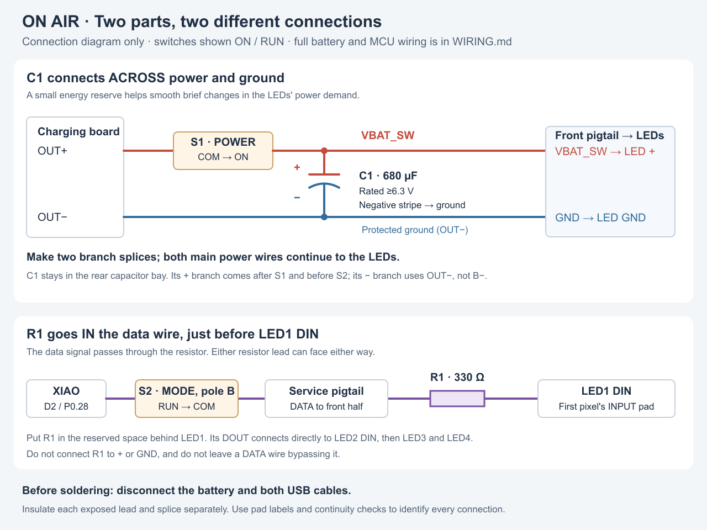

# Connecting the capacitor and data resistor

Fit **one C1: 680 µF electrolytic capacitor, rated at least 6.3 V**, and **one R1: 330 Ω resistor** for the whole four-pixel chain. Both can be soldered into the wire harness; no extra circuit board is needed. Keep the small components already fitted to each NeoPixel module.

## What they do

**C1 steadies the LED supply.** It stores a little energy and releases it during brief changes in LED current, helping reduce short voltage dips and glitches. It does not raise the battery voltage or control battery charging.

**R1 protects the first pixel's data input.** It reduces sharp signal transients and limits brief input current. It carries the data signal, not the LEDs' power, so it is not a brightness-setting resistor. The selected values and placement follow [Adafruit's NeoPixel guidance](https://learn.adafruit.com/adafruit-neopixel-uberguide/best-practices).

## Where each lead goes

[Open the scalable diagram](../reference/capacitor-resistor-wiring.svg). This is a connection diagram, not the parts' physical positions. It shows S1 and the data pole of S2 in their ON/RUN positions. The [complete wiring table](WIRING.md#exact-connections) includes the battery, XIAO power and both switch poles.

| Part lead | Solder it to | Meaning |
| --- | --- | --- |
| C1 **positive (+)** | The **VBAT_SW** splice joining S1 POWER's ON terminal to the front pigtail's LED-power wire | Switched power, before the small S2 MODE switch |
| C1 **negative (−)** | The protected-ground splice joining charger **OUT−** to the front pigtail's GND wire and XIAO GND | The common ground return |
| Either R1 lead | The **front half of the pigtail's DATA wire**, which comes from S2 pole B common when connected | Signal arriving from the microcontroller through MODE |
| Other R1 lead | **LED1 DIN** (or a very short insulated lead to DIN) | Signal entering the first pixel |

The capacitor goes **across two wires**: one lead to power, the other to ground. Each of those wires still continues to the LEDs. Do not cut the power wire and put the capacitor end-to-end in it.

The resistor goes **end-to-end in one wire**: DATA must pass through R1 to reach LED1 DIN. Do not connect either R1 lead to power or ground, and do not leave a second wire bypassing it. R1 works either way around. Add it only before LED1; keep the three subsequent DOUT-to-DIN links direct.

## Solder C1 into the power harness

1. Disconnect the battery and both USB cables. Set POWER to OFF and MODE to PROGRAM. If the capacitor has been powered, check that it has discharged before handling its leads; do not short them together with a tool.
2. Identify C1's polarity **before clipping its leads**. On the usual radial aluminum electrolytic, the stripe marked **−** identifies the negative lead, and the untouched longer lead is positive. Verify the markings on your actual part; lead length cannot identify polarity after trimming. Reversing an electrolytic can damage it. [Adafruit's capacitor polarity example](https://learn.adafruit.com/adafruit-neopixel-uberguide/powering-neopixels).
3. Make two short insulated branch leads for C1. Slide heat-shrink tubing onto each before soldering. Solder one to C1 + and the other to C1 −, then sleeve each exposed lead and joint separately so they cannot touch.
4. Join C1's positive branch to **VBAT_SW**, the same splice that feeds the front LED-power pigtail. Join its negative branch to **charger OUT− / protected ground**. Insulate these splices separately too. Use OUT−, not B−: bridging those charger terminals externally would bypass the board's protection.
5. Keep both branches short with enough slack to install the part without pulling its leads. Lay C1 in the existing **right lower capacitor bay** and secure its insulated body. The selected body must be no larger than **8 mm diameter × 11.5 mm long**. Keep its leads clear of the pouch, screw pockets and guide keeper; do not cover its pressure-relief vent with adhesive.

C1 remains on the **rear housing side** of the service disconnect. Its power branch comes directly from S1's switched rail; it does not pass through either pole of the tiny DPDT. The front LED power and ground wires stay continuous. This is a bulk capacitor for the harness; the modules retain their local SMD capacitors.

## Solder R1 into the front DATA lead

1. Identify LED1 by its **DIN/DI** label or the arrow pointing into that module. In this enclosure LED1 is the lower-right module when viewed from the front; use its actual pad labels to distinguish DIN from DOUT. [Adafruit's input-pad guidance](https://learn.adafruit.com/adafruit-neopixel-uberguide/basic-connections).
2. Check the loose resistor with the meter's resistance setting: it should read about **330 Ω**, allowing for its marked tolerance. For a common four-band part the code is orange–orange–brown, followed by its tolerance band. Use the meter if the bands are unclear.
3. Leave the front pigtail's power and ground wires intact. Terminate its **DATA** wire at one R1 lead; solder the other R1 lead to a short insulated wire ending at **LED1 DIN**. Keep R1 near DIN in the bottom interior at X70–82, Y5.2–8.4, depth 18–21.2 from the front face. Follow the broad return bend shown in [the routing guide](FRONT-WIRING.md), keeping the remaining lead to DIN as short as this route allows.
4. Insulate both resistor joints, then sleeve the whole resistor assembly as needed. Keep its finished size within **12 mm long × 3.2 mm diameter**. Secure the sleeve so it cannot pull on the pixel pad or obstruct the acrylic edge. Leave enough service slack to remove the front.

## Check before insulating the final splices and closing

- With R1 disconnected from the electronics, measure about 330 Ω from its incoming DATA lead to its outgoing DIN lead. A continuity beeper may stay silent at this resistance; use the ohms setting. Do not expect an exact reading through the assembled electronics.
- Trace C1 **+ to VBAT_SW** and C1 **− to OUT−** visually and with continuity checks on their individual wires. The plus and minus leads must not touch. A resistance check across the power rails can change while the meter charges the capacitor; a sustained near-zero reading needs investigation.
- Confirm R1 has no bypass, C1 is not in series with power, and the LED-power branch avoids S2. Insulate all remaining joints before reconnecting power.
- Keep POWER off and MODE in PROGRAM before connecting either USB; use only one USB port. Follow the full [mode table and commissioning procedure](WIRING.md#everyday-modes). These two parts do not replace the manual USB isolation procedure or validation of the external-NeoPixel firmware you use.
